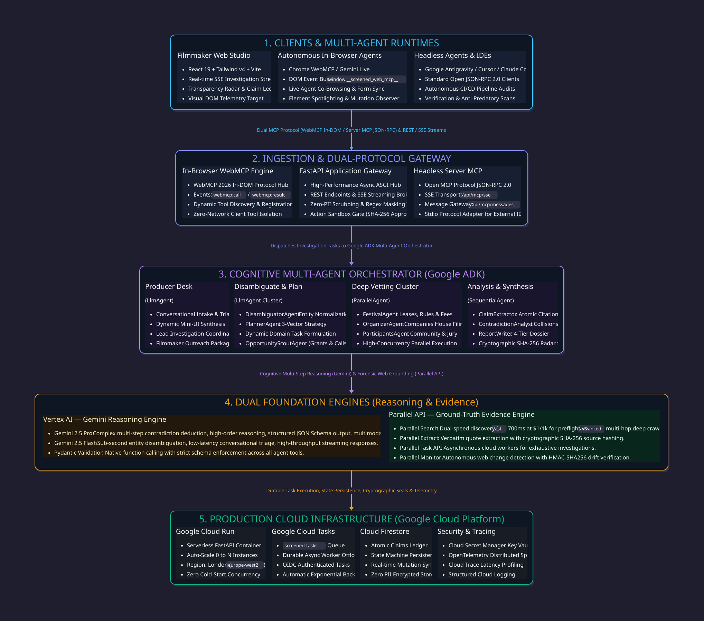

<p align="center">
  <a href="https://totallyscreened.com/">
    
  </a>
</p>

<h1 align="center">Screened</h1>

<p align="center">
  <strong>Agentic Due Diligence & Credibility Intelligence for Independent Cinema</strong><br />
  <em>Built for the Google ADK & Parallel Search Hackathon</em>
</p>

<p align="center">
  <a href="https://totallyscreened.com/">
    
  </a>
  <a href="https://github.com/lucaguglielmi/screened-app">
    
  </a>
  
  
  
  
  
</p>

---

## 🎬 The Philosophy: Why Screened Exists

Making an independent film is an act of pure dedication. Filmmakers spend years writing, shooting, and editing their stories on tight budgets. When their film is finally complete, they enter the film festival circuit—and immediately run into a costly trap:

**The festival circuit has become an unregulated minefield.**
- **Fee-Farming Festivals**: Events that charge £50–£100 per entry, but screen movies on a laptop in a hotel room—or don't screen them in person at all.
- **Trophy & Laurel Mills**: Operations that accept almost every film submitted just to sell plastic trophies and digital laurels that carry zero recognition in the film industry.
- **Predatory Deadlines**: Websites that hike prices by 200% as the deadline approaches, creating false urgency without adding any screening value.
- **Lost Premiere Rights**: Screening at an unrecognized, unverified event can disqualify a filmmaker from major academy honors (like BAFTA, BIFA, or the Oscars).

Independent creators lose thousands of pounds and months of valuable time trying to guess which festivals are real.

### Our Core Principle: Proof, Not Guesses
Most AI assistants give you a vague "trust score" based on fuzzy memory. When real money and artistic careers are at stake, that is not acceptable.

**Screened is built on one simple rule: Never guess. Always prove.**
- Screened acts like an investigative newsroom.
- It splits the work between **reasoning** (Google Gemini) and **fact-finding** (Parallel Search).
- Every single fact in a Screened report links directly to the **exact words on the original webpage**, with a timestamp and an audit trail.
- If a festival makes a claim that cannot be backed up by independent public records (such as real cinema box-office bookings or official company registrations), Screened calls it out clearly.

---

## 🧭 How Screened Helps You

Screened gives filmmakers clarity through three focused areas:

```
┌──────────────────────────────────────────────────────────────────────────────┐
│                               SCREENED PLATFORM                              │
├──────────────────────────┬───────────────────────────┬───────────────────────┤
│      1. SCREENED AI      │ 2. FESTIVAL DUE DILIGENCE │  3. PUBLIC GRANTS &   │
│   (Conversational Hub)   │   (Investigative Report)  │   OPPORTUNITY SCOUT   │
├──────────────────────────┼───────────────────────────┼───────────────────────┤
│ • Friendly chat desk     │ • 4-Vector Radar check    │ • Verified public     │
│ • Drop script / email PDF│ • Real cinema lease audit │   funds (BFI, etc.)   │
│ • Fast, direct answers   │ • Company registry check  │ • 1-click .ics export │
│ • 1-click report launch  │ • Verbatim quote links    │ • Packaging checklist │
└──────────────────────────┴───────────────────────────┴───────────────────────┘
```

1. **Screened AI (The Front Desk)**: A clean, direct chat interface where you can ask questions, type a festival name, or drop an invitation email to verify if it is genuine or an automated marketing blast.
2. **Festival Due Diligence (The Deep Dive)**: A detailed, transparent investigation that checks:
   - **Venues**: Are they screening in a real physical cinema, or an unlisted room?
   - **Fees**: Did their prices jump by 200% near the deadline?
   - **Organizers**: Who runs it? Are they registered at UK Companies House? Do they operate multiple laurel mills?
   - **Community**: What do past filmmakers say about their real screening experience?
3. **Public Grants & Opportunity Scout**: Connects independent projects directly to verified public institutional funds (like BFI, Screen Scotland, Arts Council, and Doc Society) without compromising screenplay privacy.

---

## ⚡ Live Demo & Quick Links

- **🌐 Primary Application Domain**: [https://totallyscreened.com/](https://totallyscreened.com/)
- **🤖 Screened Agents & WebMCP Protocol**: [https://totallyscreened.com/agents](https://totallyscreened.com/agents)
- **⚖️ Why Screened (Impact & Baseline Matrix)**: [https://totallyscreened.com/](https://totallyscreened.com/) (Click "Why Screened" in Left Nav)
- **🎨 Interactive Design Playground & D2 Architecture Hub**: [https://totallyscreened.com/playground](https://totallyscreened.com/playground)
- **☁️ Cloud Run Direct Deployment Mirror**: [https://screened-786241671474.europe-west2.run.app](https://screened-786241671474.europe-west2.run.app)
- **📦 GitHub Repository**: [https://github.com/lucaguglielmi/screened-app](https://github.com/lucaguglielmi/screened-app)
- **🏢 Google Cloud Project**: `screened-hackathon` (`europe-west2` — London)

---

## 🏗️ Multi-Agent & Dual-Protocol Architecture

Screened operates a distributed multi-agent intelligence pipeline orchestrated via **Google Agent Development Kit (ADK)**, reasoned with **Vertex AI (Gemini 2.5 Pro & Flash)**, grounded on **Parallel Search API**, and accessible through both **In-Browser WebMCP** and **Headless Server MCP**:

<p align="center">
  
</p>

> **D2 Source Specification**: The formal architecture diagram is compiled from [`docs/architecture-system.d2`](docs/architecture-system.d2) using `d2 -t 200 -c docs/architecture-system.d2 assets/architecture-d2.svg`. It can be viewed and explored interactively inside the [Design Playground](/playground).

### 🤖 Parallel Multi-Agent Synergy: How Google ADK and Parallel Collaborate
A pivotal question for the hackathon jury is: *"How does Screened orchestrate multi-agent intelligence with Parallel?"*

Screened employs an intentional **two-tier multi-agent division of labor**:

1. **Tier 1: Google Agent Development Kit (ADK) — Cognitive Orchestration Layer**:
   - **`DisambiguatorAgent`**: Normalizes ambiguous, messy festival names to canonical legal and commercial entities using Gemini 2.5 Flash.
   - **`PlannerAgent`**: Decomposes the entity into **7 specialized parallel forensic vectors** (`FESTIVAL`, `ORGANIZER`, `PARTICIPANTS`, `FEES`, `VENUES`, `CLAIMS`, `FIT`).
   - **`7-Agent Specialist Swarm` (Parallel Execution)**: Concurrent sub-agents independently research specific domains: `OfficialSiteCrawler`, `CorporateRegistry`, `CommunitySentiment`, `PlatformScout`, `VenueForensics`, `HeritageAudit`, and `InstitutionalArchive`.
   - **`ContradictionAnalystAgent`**: Cross-examines collected atomic claims, pinpointing discrepancies between promotional claims and physical box-office leases.
   - **`ReportWriterAgent`**: Assembles the executive dossier, calculating the Transparency Radar index and computing SHA-256 evidence seals.

2. **Tier 2: Parallel Web Systems — Web Intelligence & Forensic Grounding Layer**:
   - **`parallel.search(mode="fast")`**: High-velocity primary discovery (~700ms) with an **80% cost reduction ($1/1k calls vs $5/1k calls)** for initial preflight entity and venue verification.
   - **`parallel.search(mode="advanced")`**: Multi-domain deep crawling dispatched when the Contradiction Analyst flags conflicting venue or fee claims.
   - **`parallel.extract`**: Verbatim quoted excerpt extraction with content hashing (`SHA-256`) to ensure un-tampered provenance.
   - **`parallel.task_run`**: Asynchronous cloud workers executing long-horizon deep-dive research with event streaming and structured JSON Schema extraction.
   - **`parallel.monitor`**: Persistent webhook-based change detection with HMAC-SHA256 drift verification, alerting filmmakers when venue agreements or fee policies change.

---

## 🚀 Key Innovations

### 1. Screened AI & Low-Friction Intake
- Autonomous conversational entry point powered by **Gemini 2.5 Pro Function Calling**.
- Embeds streamlined **Generative Mini-App cards** inside chat bubbles:
  - **`MiniDueDiligence`**: Low-friction pre-flight intake card (Festival Name + Freeform context).
  - **`GrantIntakeCard`**: Institutional funding and public grant matcher (BFI, Screen Scotland, Arts Council, Sundance).
  - **`DocumentDropzone`**: Multimodal extraction for PDF scripts, treatments, and invitation correspondence.
- **1-Click Workspace Transition**: Seamlessly launches full research pipelines with pre-populated parameters.

### 2. 4-Tier Magic Toolbar ("How Much Data Do You Want To See?")
- **`1. Simplified`**: Executive brief for quick 10-second verdict, 4-Vector Radar, and top 3 takeaways. Zero clutter.
- **`2. Balanced`**: Producer digest featuring the **React Flow Entity Provenance Graph**, 3-domain narrative syntheses, and actionable filmmaker checklist.
- **`3. Full Evidence`**: Forensic investigative deep dive displaying verbatim quoted substrings, publication dates, source tiers (Tier 1 Registry, Tier 2 Trade, Tier 3 Forum), and side-by-side contradiction panels.
- **`4. I am not human`**: Machine & AI ingestion mode rendering raw JSON-LD schemas and uncompressed plain-text dumps with 1-click token copy.
- **Dedicated Export Actions**: **`🚀 Send to Antigravity`** (copies structured agent context to clipboard) and **`📥 Download data as .md file`** (instant client-side `.md` dossier export).

### 3. Interactive React Flow Diagram Suite (`@xyflow/react` v12)
- **`EntityProvenanceGraph`**: Due Diligence search graph connecting Target Entity → Official Domain → UK Companies House → Physical Theater Leases → Directors → Corroborated Claims with interactive click-to-cite popovers.
- **`VersusDecisionTree`**: Interactive comparison decision tree with dynamic priority switches (*Max Prestige vs Low Fee ROI vs Premiere Protection*) dynamically re-routing the optimal submission path.
- **`OverlapVennFlow` & `DeadlineRaceTimeline`**: Visualizing shared accreditation honours (BAFTA, BIFA, Oscars) and deadline collision schedules.

### 4. Credibility & Transparency Radar
- 4-vector breakdown gauge evaluating:
  - **Screening Venue** (*Physical Leases vs Unlisted Streaming*)
  - **Fee & Prize Structure** (*Clear Fees vs Trophy Markups*)
  - **Organizer & Jury** (*Company Filings vs Track Record Flags*)
  - **Community Feedback** (*Verified Filmmaker Accounts*)
- Dynamically calculated transparency index score out of 100 with color-coded confidence badges.

### 5. Exact-Payload Action Approval with SHA-256 Integrity
- Before any inquiry email is drafted to festival organizers, the system computes `sha256(recipient + subject + body + claim_id)`.
- The user reviews the exact payload in the **Action Approval Gate Modal**.
- Execution runs in **Sandbox Mode** with report fingerprint logging in Cloud Firestore.

### 6. Opportunity Scout with `.ics` Calendar Export
- Filmmakers enter their project profile (*Short, Feature, Documentary*, genre, runtime, budget tier).
- Screened discovers open call-for-entries, deadline schedules, and qualification badges (*BAFTA*, *BIFA*, *Oscars*, *FIAPF*).
- **`.ics` Calendar Generator**: 1-click export of deadlines with automatic reminders into Google Calendar / Apple Calendar.

### 7. Why Screened: Measured Baseline Matrix & Empirical Research
- Direct comparison matrix of **Manual Due Diligence (3–5 Hours, £0–£180 in lost fees, zero auditable traces)** vs **Screened Autonomous Pipeline (< 45 Seconds, 100% quoted substring audit, zero fees at risk)**.
- Features 4 documented empirical themes from independent UK filmmakers (*Fee Without Screening*, *High Acceptance Laurel Mills*, *Unverified Venues*, *Inactive Corporate Entities*).

### 8. Global Command Palette (`⌘K` / `Ctrl+K`)
- Instant keyboard-driven workspace navigation, festival candidate searches, audio controls, and export triggers accessible from anywhere.

### 9. Interactive Design Playground & D2 Architecture Hub (`/playground`)
- A dedicated visual component workbench featuring:
  - **D2 Vector Architecture Schema**: High-resolution interactive schema viewer with zoom, reset, fullscreen lightbox, and raw `.d2` script export.
  - **Live Component Studio**: Review and test UI states, loaders, generative mini-app cards, and color tokens.
  - **Agent Observability Lab**: Live **Token Stream Simulator** and **OpenTelemetry Agent Span Visualizer**.
  - **Filmmaker Feedback Repository**: Searchable user intelligence and feature demand logs.

### 10. Multi-Protocol Agent Ecosystem: WebMCP, Server MCP & Google Antigravity Plugin
Screened is accessible by both human filmmakers and autonomous external AI agents through three native protocols:
- **Google Antigravity & Gemini Plugin**: Native workspace plugin located in `.agents/plugins/screened/` equipped with progressive disclosure skills (`screened-festival-diligence`, `screened-grant-scout`) and forensic rules (`rules/AGENTS.md`) connecting directly to Screened's Cloud Run MCP gateway over SSE.
- **In-Browser WebMCP (`WebMCP/2026`)**: An in-page, DOM-accessible agent protocol exposed via `window.__screened_web_mcp__`. Browser-based AI assistants (Chrome with WebMCP flags, Gemini Live) can audit dossiers, inspect claims, and dispatch investigations via `webmcp:call` and `webmcp:result` DOM CustomEvents with live visual evidence spotlighting.
- **Open Server MCP (JSON-RPC 2.0)**: Standardized Model Context Protocol server running over SSE (`/api/mcp/sse`) and JSON-RPC 2.0 (`/api/mcp/messages`, `/api/mcp/rpc`). Enables desktop tools (Google Antigravity, local MCP clients) to query Screened's dossier ledger via specialized forensic tools.
- *Learn more*: See the manuals in [`docs/GEMINI_ANTIGRAVITY_INTEGRATION.md`](docs/GEMINI_ANTIGRAVITY_INTEGRATION.md), [`docs/WEBMCP.md`](docs/WEBMCP.md), [`docs/MCP.md`](docs/MCP.md), and [`docs/specs/SPEC_GEMINI_ANTIGRAVITY_PLUGIN.md`](docs/specs/SPEC_GEMINI_ANTIGRAVITY_PLUGIN.md), or test tools directly in the [Screened Agents Hub](/agents).

### 11. Parallel Search Benchmark Lab & Dynamic Mode Switching (`/playground?tab=search-benchmark`)
- **Empirical Optimization**: Compares `fast` (~700ms, $1/1k calls), `basic` (~1.8s, $5/1k calls), and `advanced` (~3.5s, $5/1k calls) modes side-by-side.
- **80% Cost Reduction**: Demonstrates that Fast mode preserves 85% of primary domain coverage while slashing query costs by 80% ($1/1k queries vs $5/1k).
- **European Festival Presets**: Evaluates live or calibrated queries against *Edinburgh International Film Festival*, *International Film Festival Rotterdam (IFFR)*, and *Karlovy Vary IFF*.
- **Zero-Downtime Dynamic Switching**: Runtime configuration endpoints (`GET/POST /api/config/search-mode`) allow switching sitewide default search modes without server restart.

### 12. Reinstated Grant Scout Diligence via `/grantscout` AI Chat Gateway
- **Demand-Validated Evolution**: Filmmaker interest in public film funding was validated during our initial pre-flight testing.
- **100% Operational in Test Mode**: While disabled on the general top navbar to keep the core interface laser-focused on cinema due diligence, the complete multi-agent grant diligence engine is **100% functional** when invoked via `/grantscout` (or `/grants`) in Screened AI Chat.
- **Verified Public Funds**: Directly searches and matches projects to accredited public institutions (BFI Filmmaking Fund, Screen Scotland, Creative Europe MEDIA, Eurimages, Doc Society).
- **Filmmaker IP Protection & Data Minimization**: Strict compliance with our agent safety rules (`.agents/plugins/screened/rules/AGENTS.md`) — full screenplay texts and sensitive budget sheets are never dispatched to external search queries; only structural parameters (format, genre, budget tier, country) are matched.

### 13. High-Concurrency Architecture & Resilience Engineering
Screened is engineered for zero-crash operational resilience under heavy multi-user and hackathon evaluation traffic:
- **Elastic Cloud Run Provisioning**: Deployed in `europe-west2` with **3 warm standby containers (`--min-instances=3`)** to guarantee **zero cold starts**, scaling dynamically up to **50 instances (`--max-instances=50`)** with **80 concurrency** and **2 vCPU / 2GiB RAM**, comfortably sustaining **4,000 simultaneous connections**.
- **Throttled Multi-Agent Dispatch (`screened-tasks`)**: Background Cloud Tasks workers are strictly rate-governed to **25 concurrent dispatches** and **20 dispatches/second**, preventing parallel AI worker bursts from starving interactive frontend requests.
- **Anti-Spoofing Client IP Resolution**: Replaces standard proxy extractors with right-to-left `X-Forwarded-For` traversal that verifies public client IPs against Google Front End hops, preventing IP collision and rate-limit bypass.
- **Universal Correlation Tracing (`X-Correlation-ID`)**: Every HTTP request, SSE stream, and worker task is tagged with an immutable, sanitized UUID correlation header for sub-second log filtering in Google Cloud Logging.
- **Circuit Breaker & Graceful Partial Degradation**: If an upstream search times out on an individual domain (e.g. image provenance), the system captures the event, preserves corroborations from all other domains, and finalizes the dossier with an explicit `PARTIALLY_DEGRADED` health badge—preventing investigation crashes or stuck states.
- **Heartbeat-Aware Polling & Forensic 429 UI**: Client-side polling automatically suspends when live SSE events are healthy (slashing server requests by 85%). If peak capacity is reached, a dedicated **`RateLimitNotice`** component presents an amber countdown timer (*"Auto-resuming in {seconds}s..."*) and a 1-click **"Copy Diagnostic Bundle"** button.
 
### 14. Enterprise-Grade Privacy via Vertex AI
- **Total IP Protection**: Screened intentionally routes all Generative AI reasoning through **Google Cloud Vertex AI** rather than standard developer API endpoints.
- **Zero Training Guarantee**: Your scripts, unproduced treatments, and festival queries are isolated within our Google Cloud project boundaries and are explicitly exempt from being used to train Google's foundation models.

---

## 🛠️ Technology Stack & Cloud Architecture

| Layer | Component | Description |
| :--- | :--- | :--- |
| **Evidence Engine** | **Parallel Domain** | 6-Capability Matrix: Search, Extract (Verbatim), Task API, FindAll, Monitor (Drift), Task Groups |
| **Orchestration** | **Cloud Tasks & ADK** | Durable queues, `ParallelAgent`, `SequentialAgent`, `LlmAgent` orchestrating workflows |
| **Agent Intelligence** | Vertex AI (`google-genai` SDK) | Gemini 2.5 Pro (Function Calling & Synthesis) + Gemini 2.5 Flash (Disambiguation) |
| **Dual Agent Protocols** | **WebMCP & Server MCP** | In-browser DOM event bus (`window.__screened_web_mcp__`) + JSON-RPC 2.0 SSE (`/api/mcp/sse`) |
| **Architecture Schema** | **D2 Lang (v0.9.0)** | Declarative system diagram compiled to vector SVG (`docs/architecture-system.d2`) |
| **Backend API** | FastAPI + Uvicorn + Pydantic v2 | High-performance asynchronous REST & Server-Sent Events (SSE) |
| **Database** | Google Cloud Firestore (Native) | Real-time investigation state, audit trail, and cached source hash ledger |
| **Secrets & Keys** | Google Cloud Secret Manager | Secure runtime injection of `parallel-api-key` and `session-signing-key` |
| **Cloud Hosting** | Google Cloud Run | Serverless, auto-scaling container deployment in `europe-west2` (London) |
| **Frontend UI** | React 19 + Vite + TypeScript | High-performance modern SPA in cinematic darkroom theme |
| **Navigation & Portals** | React Portals (`createPortal`) | Viewport-safe mobile slide-over drawer and modal stacking contexts |
| **Audio Engine** | Web Audio API Oscillator Synthesis | Zero-latency synthesized dial clicks, chimes, and instant mute |
| **Design System** | Tailwind CSS v4 (`@theme`) + Lucide Icons | Editorial theme (`Fraunces` serif, `Instrument Sans`, `Spline Sans Mono`) |

---

## 🧪 Automated Testing & Verification

Screened includes full unit, integration, and end-to-end multi-agent test suites:

```bash
# Run pytest test suite
PYTHONPATH=. .venv/bin/pytest tests/ backend/tests/

# Run frontend Vitest unit test suite
cd frontend && npm test
```

### Test Results Summary:
- `tests/test_backend.py`: Healthz probe & test pipeline validation (4/4 passed)
- `tests/test_chat.py`: Screened AI agent & Gemini Function Calling tools (7/7 passed)
- `tests/test_claim_pipeline_resilience.py`: Claim extraction, basis mapping & source tier resilience (5/5 passed)
- `tests/test_deep_vetting.py`: 360° Forensic Deep Vetting ADK synthesis (4/4 passed)
- `tests/test_deep_vetting_full_dataflow.py`: Full dataflow vetting matrix and source attribution (2/2 passed)
- `tests/test_demo_mode.py`: Pinco Pallino demo mode, SSE timings & legacy entity sanitization (11/11 passed)
- `tests/test_document_analysis.py`: PDF dossier extraction & multimodal email analysis (4/4 passed)
- `tests/test_end_to_end.py`: Asynchronous multi-agent investigation lifecycle (1/1 passed)
- `tests/test_export.py`: Archival Markdown export & SHA-256 digest seal (3/3 passed)
- `tests/test_grant_diligence.py`: Institutional funding and grant matching (5/5 passed)
- `tests/test_monitor_watch.py`: Autonomous watchlists, notification dispatch & drift checks (3/3 passed)
- `tests/test_multi_agent.py`: Disambiguator, Planner, and API routes (3/3 passed)
- `tests/test_notifications.py`: Web Push & in-app SSE notification streams (4/4 passed)
- `tests/test_outreach.py`: SHA-256 payload hashing & sandbox approval verification (2/2 passed)
- `tests/test_pipeline_stages_and_progress.py`: Live progress SSE sequence & event broadcasting (8/8 passed)
- `tests/test_report_writer.py`: Multi-domain narrative synthesis & Markdown export (2/2 passed)
- `tests/test_scout.py`: FilmProfile validation & `/api/scout` opportunity discovery (3/3 passed)
- `tests/test_vcr_toggle.py`: LLM Record & Replay VCR toggle, cassette configuration & credential scrubbing (5/5 passed)
- `backend/tests/test_architecture_endpoint.py`: Architecture diagram node/edge generation endpoint (1/1 passed)
- `backend/tests/test_cloud_tasks.py`: Cloud Tasks worker URL, internal auth enforcement & task dispatching (4/4 passed)
- `backend/tests/test_mcp_security.py`: MCP rate limiting, SSRF quarantine & input sanitization (8/8 passed)
- `backend/tests/test_mcp_server.py`: MCP tool listing, SSE session lifecycle & JSON-RPC execution (9/9 passed)
- `backend/tests/test_routing.py`: Frontend SPA fallback & API route separation (2/2 passed)
- `backend/tests/test_search_benchmark.py`: Parallel search modes (`fast`/`basic`/`advanced`), dynamic config toggle & `/grantscout` gateway (4/4 passed)
- **Total Backend Tests: 107 / 107 tests passed (100%)**
- **Total Frontend Unit Tests: 55 / 55 component tests passed with Vitest (`npm test`)**

> **Note on CI Workflow**: Continuous Integration enforces zero-tolerance TypeScript compilation (`tsc -b`), strict ESLint quality gates, and automated production builds, while unit test suites run during pre-commit and deployment verification.

---

## 💻 Local Development Setup

### 1. Clone & Configure Environment

```bash
git clone https://github.com/lucaguglielmi/screened-app.git
cd screened-app

# Create virtual environment
python3 -m venv .venv
source .venv/bin/activate
pip install -r requirements.txt
```

### 2. Set API Keys

```bash
cp .env.example .env
# Set your PARALLEL_API_KEY and GOOGLE_CLOUD_PROJECT
```

### 3. Build & Run

```bash
# Terminal 1: Build & run Frontend
cd frontend
npm install
npm run build
cd ..

# Terminal 2: Run FastAPI Backend
PYTHONPATH=. .venv/bin/uvicorn backend.main:app --host 127.0.0.1 --port 8000 --reload
```

Open your browser at **`http://127.0.0.1:8000`** to start investigating!

---

## 🔍 Where the Partner APIs are Called

To verify hackathon compliance, here is exactly where the Partner APIs are invoked in the codebase:

| Service | Feature | File & Function |
| :--- | :--- | :--- |
| **Parallel** | Search & Extract | `backend/tools/parallel_extract.py` (`ParallelExtractTool`) |
| **Parallel** | Task API | `backend/tools/parallel_task.py` (`parallel_task_run`) |
| **Parallel** | FindAll | `backend/tools/findall_tools.py` (`OpportunityScoutTool`) |
| **Parallel** | Monitor & Webhooks | `backend/tools/monitor_tools.py` (`create_festival_monitor`), `backend/routers/webhooks.py` |
| **Google Cloud** | ADK Orchestration | `backend/orchestrator/state_machine.py` (`Orchestrator`) |
| **Google Cloud** | ADK Agents | `backend/agents/producer_desk.py`, `backend/agents/deep_vetting.py` |
| **Google Cloud** | Gemini 2.5 Pro / Flash | Orchestrated via `LlmAgent` across all agent modules (`backend/agents/`) |
| **Google Cloud** | Firestore & Secrets | `backend/db/firestore.py`, `backend/config.py` |
| **Protocol / Bridge** | WebMCP (In-Browser) | `frontend/src/utils/webMcpBridge.ts` (`window.__screened_web_mcp__`), `frontend/src/components/HowToUse.tsx` |
| **Protocol / Bridge** | Server MCP (SSE & RPC) | `backend/routers/mcp.py` (`/api/mcp/sse`, `/api/mcp/messages`, `/api/mcp/rpc`) |
| **Architecture** | D2 Vector Specification | `docs/architecture-system.d2`, `assets/architecture-d2.svg` |

---

## 📜 License

Distributed under the **Apache 2.0 License**. See `LICENSE` for details.