<p align="center">
  <a href="https://github.com/lucaguglielmi/screened-app">
    
  </a>
</p>

<p align="center">
  <strong>Agentic Due Diligence & Credibility Intelligence for the Cinema Industry</strong>
</p>

<p align="center">
  
  
  
  
</p>

---

## 🎬 Overview

**Screened** is an agentic investigation workspace designed to help filmmakers, producers, festivals, and cinema professionals evaluate credibility, partnerships, and industry claims with complete evidentiary transparency.

Rather than assigning an arbitrary or opaque "trust score", **Screened** functions as an autonomous research assistant. It gathers public evidence across trade publications, company registers, festival archives, official records, and industry accounts—linking every single claim directly to its underlying proof.

```
                  ┌─────────────────────────────────────┐
                  │      SUBJECT / ENTITY OF QUERY      │
                  └──────────────────┬──────────────────┘
                                     │
           ┌─────────────────────────┼─────────────────────────┐
           ▼                         ▼                         ▼
  [ Track A: Identity ]    [ Track B: Claims & Ops ]  [ Track C: Sentiment ]
  Official Filings & Org    Edition History & Prizes   Press & Creator Reports
           │                         │                         │
           └─────────────────────────┼─────────────────────────┘
                                     ▼
                  ┌─────────────────────────────────────┐
                  │    EVIDENCE GRAPH & VERIFICATION    │
                  │  Corroborated · Disputed · Unknown  │
                  └──────────────────┬──────────────────┘
                                     ▼
                  ┌─────────────────────────────────────┐
                  │    CHAIN-OF-CUSTODY AUDIT DOSSIER   │
                  └─────────────────────────────────────┘
```

---

## ⚡ Core Capabilities

- **🔍 Parallel Multi-Track Research**: Autonomous investigation agents dissect subject claims across identity verification, historical track records, and independent third-party coverage.
- **🕸️ Evidence Constellation**: Structured graph visualization connecting people, companies, past film festival editions, screening claims, and corroborated proofs.
- **🔗 Chain of Custody**: Every claim references permanent source URLs, exact text snippets, extraction timestamps, and cryptographic payload hashes.
- **⚖️ Nuanced Verification States**: Replaces simplistic true/false flags with calibrated evidence states: *Corroborated*, *Disputed*, *Inconclusive*, and *Missing Corroboration*.
- **🛡️ Human-in-the-Loop Safeguards**: Automated agents never publish externally, make unilateral judgments, or reach out to contacts without explicit human review and approval gates.

---

## 🛠️ Tech Stack & Design System

| Layer | Technologies & Design Patterns |
| :--- | :--- |
| **Frontend UI** | Next.js / React, TailwindCSS, Motion, Radix UI Primitives |
| **Typography** | `Fraunces` (Editorial Masthead & Display), `Instrument Sans` (UI Chrome), `Spline Sans Mono` (Chain of Custody) |
| **AI / Agent Engine** | Gemini Multimodal Models, Function Calling & Structured Extraction, Graph RAG |
| **Security & Privacy** | Local-First Caching, Granular Source Attribution, Redaction-Safe Exporting |

---

## 🚀 Getting Started

### Prerequisites
- Node.js 18+ or 20+
- npm / pnpm / yarn

### Installation

```bash
# Clone the repository
git clone https://github.com/lucaguglielmi/screened-app.git

# Navigate into the project directory
cd screened-app

# Install dependencies
npm install

# Start local development server
npm run dev
```

---

## 📜 License

This project is licensed under the [Apache 2.0 License](LICENSE).