<p align="center">
  <a href="https://screened-pludf2u7yq-nw.a.run.app">
    
  </a>
</p>

<h1 align="center">Screened</h1>

<p align="center">
  <strong>Agentic Due Diligence & Credibility Intelligence for Independent Cinema</strong><br />
  <em>Built for the Google ADK & Parallel Search Hackathon</em>
</p>

<p align="center">
  <a href="https://screened-pludf2u7yq-nw.a.run.app">
    
  </a>
  <a href="https://github.com/lucaguglielmi/screened-app">
    
  </a>
  
  
  
</p>

---

## 🎬 The Mission

Every year, independent filmmakers spend thousands of pounds on festival submission fees, only to encounter opaque screening venues, predatory organizers, deceptive premiere policies, or awards that fail to qualify for major honors (BAFTA, BIFA, Oscars).

**Screened** transforms cinema due-diligence from guesswork into an autonomous, transparent multi-agent investigation. Rather than assigning an arbitrary or blackbox "trust score", Screened functions as an investigative research room:
1. **Screened AI (Conversational Agent Hub)**: Talks with filmmakers, analyzes queries or uploaded PDF scripts/emails, and autonomously dispatches specialized tools via **Gemini Function Calling API**.
2. **Dissects Subject Entities**: Scrutinizes legal identity, physical venues, fee schedules, jury prestige, and filmmaker community feedback.
3. **Gathers Public Evidence**: Pulls verified data from official registries, festival archives, major trade publications (Variety, ScreenDaily), and community forums.
4. **Cites Every Atomic Claim**: Direct links to verbatim quotes with source tier tags, retrieval timestamps, and SHA-256 report fingerprints.
5. **Scouts Strategic Opportunities & Grants**: Matches film profiles to verified open calls and public institutional grant funds (BFI, Screen Scotland, Arts Council, Sundance) with `.ics` calendar exports.

---

## ⚡ Live Demo & Quick Links

- **🌐 Live Cloud Run Application**: [https://screened-pludf2u7yq-nw.a.run.app](https://screened-pludf2u7yq-nw.a.run.app)
- **⚖️ Why Screened (Impact & Baseline Matrix)**: [https://screened-pludf2u7yq-nw.a.run.app](https://screened-pludf2u7yq-nw.a.run.app) (Click "Why Screened" in Left Nav)
- **🎨 Interactive Design Playground & OTel Tracing Lab**: [https://screened-pludf2u7yq-nw.a.run.app](https://screened-pludf2u7yq-nw.a.run.app) (Click "Design Lab" in Nav)
- **📦 GitHub Repository**: [https://github.com/lucaguglielmi/screened-app](https://github.com/lucaguglielmi/screened-app)
- **🏢 Google Cloud Project**: `screened-hackathon` (`europe-west2` — London)

---

## 🏗️ Multi-Agent Architecture

Screened operates an orchestrated pipeline of specialized autonomous agents using **Vertex AI (Gemini 2.5 Pro & Gemini 2.5 Flash)** and the **Parallel Search API**:
<p align="center">
  
</p>

---

## 🚀 Key Innovations

### 1. Screened AI & Low-Friction Intake
- Autonomous conversational entry point powered by **Gemini 2.5 Pro Function Calling**.
- Embeds streamlined **Generative Mini-App cards** inside chat bubbles:
  - **`MiniDueDiligence`**: Low-friction pre-flight intake card (Festival Name + Freeform context).
  - **`GrantIntakeCard`**: Institutional funding and public grant matcher (BFI, Screen Scotland, Arts Council, Sundance).
  - **`DocumentDropzone`**: Multimodal extraction for PDF scripts, treatments, and invitation correspondence.
- **1-Click Workspace Transition**: Seamlessly launches full research pipelines with pre-populated parameters.

### 2. 4-Tier Magic Toolbar ("How Much Data Do You Want To See?")
- **`1. Simplified`**: Executive brief for quick 10-second verdict, 4-Vector Radar, and top 3 takeaways. Zero clutter.
- **`2. Balanced`**: Producer digest featuring the **React Flow Entity Provenance Graph**, 3-domain narrative syntheses, and actionable filmmaker checklist.
- **`3. Full Evidence`**: Forensic investigative deep dive displaying verbatim quoted substrings, publication dates, source tiers (Tier 1 Registry, Tier 2 Trade, Tier 3 Forum), and side-by-side contradiction panels.
- **`4. I am not human`**: Machine & AI ingestion mode rendering raw JSON-LD schemas and uncompressed plain-text dumps with 1-click token copy.
- **Dedicated Export Actions**: **`🚀 Send to Antigravity`** (copies structured agent context to clipboard) and **`📥 Download data as .md file`** (instant client-side `.md` dossier export).

### 3. Interactive React Flow Diagram Suite (`@xyflow/react` v12)
- **`EntityProvenanceGraph`**: Due Diligence search graph connecting Target Entity → Official Domain → UK Companies House → Physical Theater Leases → Directors → Corroborated Claims with interactive click-to-cite popovers.
- **`VersusDecisionTree`**: Interactive comparison decision tree with dynamic priority switches (*Max Prestige vs Low Fee ROI vs Premiere Protection*) dynamically re-routing the optimal submission path.
- **`OverlapVennFlow` & `DeadlineRaceTimeline`**: Visualizing shared accreditation honours (BAFTA, BIFA, Oscars) and deadline collision schedules.

### 4. Credibility & Transparency Radar
- 4-vector breakdown gauge evaluating:
  - **Screening Venue** (*Physical Leases vs Unlisted Streaming*)
  - **Fee & Prize Structure** (*Clear Fees vs Trophy Markups*)
  - **Organizer & Jury** (*Company Filings vs Track Record Flags*)
  - **Community Feedback** (*Verified Filmmaker Accounts*)
- Dynamically calculated transparency index score out of 100 with color-coded confidence badges.

### 5. Exact-Payload Action Approval with SHA-256 Integrity
- Before any inquiry email is drafted to festival organizers, the system computes `sha256(recipient + subject + body + claim_id)`.
- The user reviews the exact payload in the **Action Approval Gate Modal**.
- Execution runs in **Sandbox Mode** with report fingerprint logging in Cloud Firestore.

### 6. Opportunity Scout with `.ics` Calendar Export & Accreditation Tooltips
- Filmmakers enter their project profile (*Short, Feature, Documentary*, genre, runtime, budget tier).
- Screened discovers open call-for-entries, deadline schedules, and qualification badges (*BAFTA*, *BIFA*, *Oscars*, *FIAPF*).
- **`.ics` Calendar Generator**: 1-click export of deadlines with automatic reminders into Google Calendar / Apple Calendar.

### 7. Why Screened: Measured Baseline Matrix & Empirical Research
- Direct comparison matrix of **Manual Due Diligence (3–5 Hours, £0–£180 in lost fees, zero auditable traces)** vs **Screened Autonomous Pipeline (< 45 Seconds, 100% quoted substring audit, zero fees at risk)**.
- Features 4 documented empirical fraud themes from independent UK filmmakers (*Fee Without Screening*, *Laurel Mills*, *Phantom Venues*, *Ghost Organizers*).

### 8. Global Command Palette (`⌘K` / `Ctrl+K`)
- Instant keyboard-driven workspace teleportation, festival candidate jump-searches, theme toggles, audio controls, and export triggers accessible from anywhere.

### 9. Interactive Design Playground & Agent Observability Lab
- A dedicated visual component studio to review, test, state-cycle, and modify all chat bubbles, loaders, and mini-app cards with a live **Token Stream Simulator** and **OpenTelemetry Agent Span Visualizer**.

---

## 🛠️ Technology Stack & Cloud Architecture

| Layer | Component | Description |
| :--- | :--- | :--- |
| **Evidence Engine** | **Parallel Domain** | 6-Capability Matrix: Search, Extract (Verbatim), Task API, FindAll, Monitor (Drift), Task Groups |
| **Orchestration** | **Cloud Tasks & ADK** | Durable queues, `ParallelAgent`, `SequentialAgent`, `LlmAgent` orchestrating workflows |
| **Agent Intelligence** | Vertex AI (`google-genai` SDK) | Gemini 2.5 Pro (Function Calling & Synthesis) + Gemini 2.5 Flash (Disambiguation) |
| **Backend API** | FastAPI + Uvicorn + Pydantic v2 | High-performance asynchronous REST & Server-Sent Events (SSE) |
| **Database** | Google Cloud Firestore (Native) | Real-time investigation state, audit trail, and cached source hash ledger |
| **Secrets & Keys** | Google Cloud Secret Manager | Secure runtime injection of `parallel-api-key` and `session-signing-key` |
| **Cloud Hosting** | Google Cloud Run | Serverless, auto-scaling container deployment in `europe-west2` (London) |
| **Frontend UI** | React 19 + Vite + TypeScript | High-performance modern SPA with dark/light mode toggle |
| **Navigation & Portals** | React Portals (`createPortal`) | Viewport-safe mobile slide-over drawer and modal stacking contexts |
| **Audio Engine** | Web Audio API Oscillator Synthesis | Zero-latency synthesized dial clicks, chimes, and instant mute |
| **Design System** | Tailwind CSS v4 (`@theme`) + Lucide Icons | Editorial theme (`Fraunces` serif, `Instrument Sans`, `Spline Sans Mono`) |

---

## 🧪 Automated Testing & Verification

Screened includes full unit, integration, and end-to-end multi-agent test suites:

```bash
# Run pytest test suite
PYTHONPATH=. .venv/bin/pytest tests/
```

### Test Results Summary:
- `tests/test_backend.py`: Healthz probe & test pipeline validation (4/4 passed)
- `tests/test_chat.py`: Screened AI agent & Gemini Function Calling tools (7/7 passed)
- `tests/test_claim_pipeline_resilience.py`: Claim extraction, basis mapping & source tier resilience (5/5 passed)
- `tests/test_deep_vetting.py`: 360° Forensic Deep Vetting ADK synthesis (4/4 passed)
- `tests/test_deep_vetting_full_dataflow.py`: Full dataflow vetting matrix and source attribution (2/2 passed)
- `tests/test_demo_mode.py`: Pinco Pallino demo mode, SSE timings & legacy entity sanitization (11/11 passed)
- `tests/test_document_analysis.py`: PDF dossier extraction & multimodal email analysis (4/4 passed)
- `tests/test_end_to_end.py`: Asynchronous multi-agent investigation lifecycle (1/1 passed)
- `tests/test_export.py`: Archival Markdown export & SHA-256 digest seal (1/1 passed)
- `tests/test_monitor_watch.py`: Autonomous watchlists, notification dispatch & drift checks (3/3 passed)
- `tests/test_multi_agent.py`: Disambiguator, Planner, and API routes (3/3 passed)
- `tests/test_notifications.py`: Web Push & in-app SSE notification streams (4/4 passed)
- `tests/test_outreach.py`: SHA-256 payload hashing & sandbox approval verification (2/2 passed)
- `tests/test_pipeline_stages_and_progress.py`: Live progress SSE sequence & event broadcasting (8/8 passed)
- `tests/test_scout.py`: FilmProfile validation & `/api/scout` opportunity discovery (3/3 passed)
- **Total: 62 / 62 tests passed (100%)**

---

## 💻 Local Development Setup

### 1. Clone & Configure Environment

```bash
git clone https://github.com/lucaguglielmi/screened-app.git
cd screened-app

# Create virtual environment
python3 -m venv .venv
source .venv/bin/activate
pip install -r requirements.txt
```

### 2. Set API Keys

```bash
cp .env.example .env
# Set your PARALLEL_API_KEY and GOOGLE_CLOUD_PROJECT
```

### 3. Build & Run

```bash
# Terminal 1: Build & run Frontend
cd frontend
npm install
npm run build
cd ..

# Terminal 2: Run FastAPI Backend
PYTHONPATH=. .venv/bin/uvicorn backend.main:app --host 127.0.0.1 --port 8000 --reload
```

Open your browser at **`http://127.0.0.1:8000`** to start investigating!

---

## 🔍 Where the Partner APIs are Called

To verify hackathon compliance, here is exactly where the Partner APIs are invoked in the codebase:

| Service | Feature | File & Function |
| :--- | :--- | :--- |
| **Parallel** | Search & Extract | `backend/tools/parallel_extract.py` (`ParallelExtractTool`) |
| **Parallel** | Task API | `backend/tools/parallel_task.py` (`parallel_task_run`) |
| **Parallel** | FindAll | `backend/tools/findall_tools.py` (`OpportunityScoutTool`) |
| **Parallel** | Monitor | `backend/tools/monitor_tools.py` (`FestivalWatchTool`) |
| **Google Cloud** | ADK Orchestration | `backend/orchestrator/state_machine.py` (`Orchestrator`) |
| **Google Cloud** | ADK Agents | `backend/agents/producer_desk.py`, `backend/agents/deep_vetting.py` |
| **Google Cloud** | Gemini 2.5 Pro / Flash | Orchestrated via `LlmAgent` in all agent modules |
| **Google Cloud** | Firestore & Secrets | `backend/db/firestore.py`, `backend/config.py` |

---

## 📜 License

Distributed under the **Apache 2.0 License**. See `LICENSE` for details.