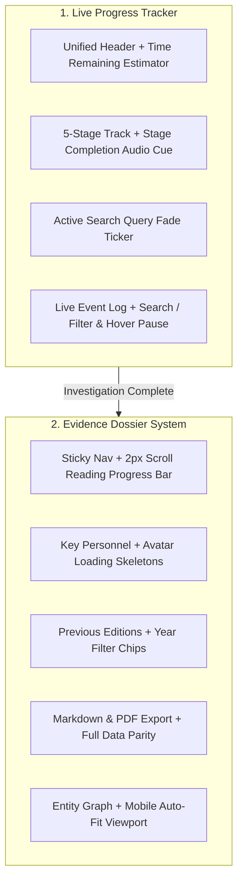

# 🎬 Technical Specification: Dossier & Live Progress Tracker Optimizations

> **Document ID**: `SPEC_DOSSIER_AND_PROGRESS_OPTIMIZATIONS`  
> **Status**: Specification Phase — *Draft / Under Review (Awaiting User Execution Approval)*  
> **Target Systems**: `frontend/src/components/EvidenceDossier.tsx`, `frontend/src/components/LiveProgress.tsx`, `frontend/src/components/investigation/`  
> **Created At**: 2026-08-30  

---

## 1. Executive Summary

This specification outlines comprehensive enhancements to the **Evidence Dossier** and **Live Progress Tracker** components. These optimizations focus on precision navigation, enhanced historical archive filtering, full export parity, refined loading states, and interactive live stream diagnostics.

---

## 2. Architecture & Component Scope

---

## 3. Detailed Technical Requirements

### 3.1 Sticky Navigation & Reading Progress Bar (`EvidenceDossier.tsx`)
1. **Reading Depth Progress Bar**:
   - Position a 2px high accent progress line at the very bottom edge of the sticky header (`div.sticky`).
   - Dynamically compute scroll percentage (`scrollPercent = (window.scrollY / (document.documentElement.scrollHeight - window.innerHeight)) * 100`).
   - Render with smooth CSS transitions using gradient `from-tool-diligence to-emerald-400`.
2. **Scroll Margins & Intersection Precision**:
   - Add explicit `scroll-mt-28 sm:scroll-mt-32` to all section container `id` tags (`#section-radar`, `#section-overview`, `#section-forensic-matrix`, `#section-previous-editions`, `#section-disputes`, `#section-network`, `#section-domains`, `#section-corporate`, `#section-claims`, `#section-checklist`, `#section-sources`).
   - Fine-tune `IntersectionObserver` root margin to `-100px 0px -60% 0px` to prevent active section flickering when jumping between sections.

---

### 3.2 Key Personnel & Directorship Interactivity (`KeyPersonnelCardList.tsx`)
1. **Avatar Image Skeleton**:
   - Wrap `avatarUrl` image in an avatar container with an animated pulse skeleton (`bg-slate-800 animate-pulse`).
   - Show skeleton until `onLoad` fires, then transition image opacity from `0` to `1` over 200ms.
   - Retain SVG initials fallback on `onError`.
2. **Directorship Profile Deep-Linking**:
   - In Corporate Entity section, render Director names as clickable links that scroll down directly to `#key-person-${person.name}` and temporarily pulse the card border.

---

### 3.3 Previous Editions Archive Filtering (`PreviousEditionsSection.tsx`)
1. **Year Filter Selector**:
   - If 3 or more past editions exist, render quick filter pill buttons at the top right of the section (`All`, `2024`, `2023`, `2022`).
   - Clicking a filter pill smooth-scrolls or filters the timeline view with an animated layout transition (`AnimatePresence`).
2. **Mobile Award Badge Optimization**:
   - Ensure award winner cards use responsive `flex-wrap` and `max-w-full` with truncated secondary metadata to prevent layout breaking on 375px screens.

---

### 3.4 Markdown & PDF Export Parity (`EvidenceDossier.tsx`)
1. **Include All New Sections in `.md` Export**:
   - **Previous Editions**: Edition year, venue location, award winners, recipient directors, and verified press URLs.
   - **Key Personnel**: Full name, primary roles, portrait avatar URL, verified LinkedIn, Companies House, Facebook, Personal Website, IMDb, and Twitter/X URLs.
   - **Directorship Conflicts & Corporate Ledger**: Associated companies, risk classifications, and governance standing.
2. **Cryptographic SHA-256 Digest**:
   - Recompute SHA-256 over the complete payload including previous editions and personnel structures.

---

### 3.5 Live Progress Tracker Polish (`LiveProgress.tsx`)
1. **Remaining Time Countdown Estimator**:
   - Compute estimated time remaining based on elapsed seconds and expected duration (~35s).
   - Display `~Xs remaining` alongside elapsed timer, transitioning to `Finalizing...` during stage 5.
2. **Stage Transition Audio Feedback**:
   - Trigger `soundEffects.playSuccess()` when the active stage transitions from `ACTIVE` to `COMPLETED`.
3. **Live Event Stream Search & Filter**:
   - Add a compact search / filter bar above the live events log (`All`, `Queries`, `Claims`, `Disputes`, or text query).
   - Add hover pause: pause auto-scrolling to newest event when the user is hovering over or interacting with the log.

---

## 4. Implementation Plan & Modified Files

| File | Proposed Changes |
| :--- | :--- |
| [`frontend/src/components/EvidenceDossier.tsx`](file:///Users/lucaguglielmi/Desktop/git/screened-app/frontend/src/components/EvidenceDossier.tsx) | Add 2px reading progress bar, refine `scroll-mt-32`, and update `handleDownloadMarkdown` with previous editions and personnel social data. |
| [`frontend/src/components/investigation/PreviousEditionsSection.tsx`](file:///Users/lucaguglielmi/Desktop/git/screened-app/frontend/src/components/investigation/PreviousEditionsSection.tsx) | Add year filter pill tabs and mobile responsive award layout. |
| [`frontend/src/components/investigation/KeyPersonnelCardList.tsx`](file:///Users/lucaguglielmi/Desktop/git/screened-app/frontend/src/components/investigation/KeyPersonnelCardList.tsx) | Add image loading skeleton fallback and deep-linkable ID anchors. |
| [`frontend/src/components/LiveProgress.tsx`](file:///Users/lucaguglielmi/Desktop/git/screened-app/frontend/src/components/LiveProgress.tsx) | Add estimated remaining timer, stage transition audio cue, event log category filter, and hover auto-scroll pause. |

---

## 5. Verification Plan

### Automated Testing
- Frontend Lint & Typecheck: `cd frontend && npm run lint && npm run build`
- Backend Pytest Suite: `PYTHONPATH=. .venv/bin/pytest tests/ backend/tests/`

### Manual Verification
- Test scroll progress indicator while scrolling through the full dossier.
- Test previous editions year filter tabs in demo mode.
- Verify downloaded `.md` report contains all historical edition and social link sections.
- Verify live event log filter in `LiveProgress.tsx` during real and demo investigations.
