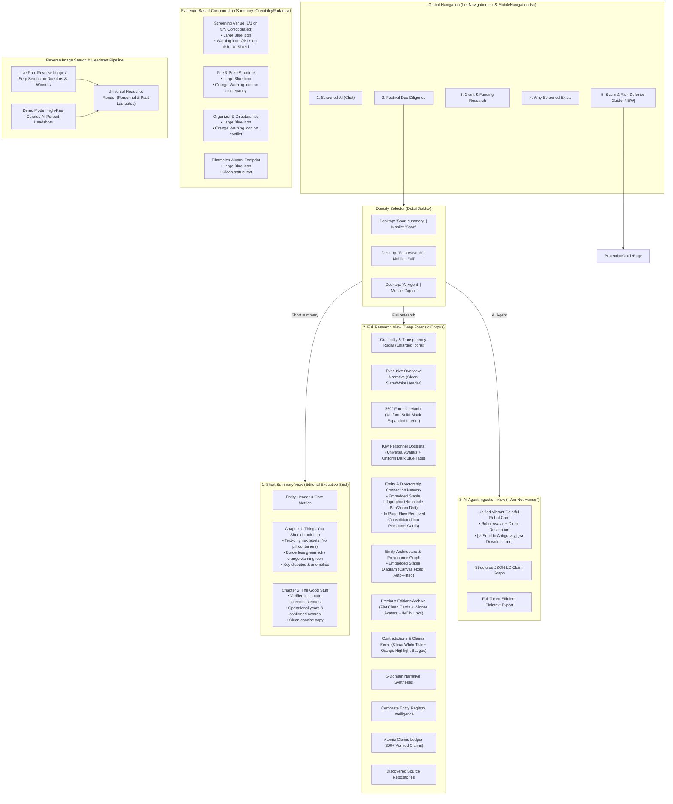

# 🎬 Technical Specification: Dossier Refinement & AI Density UX

> **Document ID**: `SPEC_DOSSIER_REFINEMENT`  
> **Status**: Specification Phase — *Draft / In Progress (Awaiting Further Additions — Do Not Execute Until Explicit Approval)*  
> **Target Systems**: `frontend/src/components/EvidenceDossier.tsx`, `frontend/src/components/DetailDial.tsx`, `frontend/src/components/CredibilityRadar.tsx`, `frontend/src/components/investigation/DeepVettingMatrix.tsx`, `frontend/src/components/investigation/KeyPersonnelCardList.tsx`, `frontend/src/components/investigation/PreviousEditionsSection.tsx`, `frontend/src/components/investigation/ContradictionPanel.tsx`, `frontend/src/components/diagrams/EntityProvenanceGraph.tsx`, `frontend/src/components/diagrams/PersonnelNetworkDiagram.tsx`, `frontend/src/components/diagrams/ScreenedFlowCanvas.tsx`, `frontend/src/components/FestivalProtectionGuide.tsx`, `frontend/src/components/ui/VerifiedTick.tsx`, `frontend/src/components/navigation/LeftNavigation.tsx`, `frontend/src/components/navigation/MobileNavigation.tsx`, `backend/demo_payloads.py`, `backend/agents/report_writer.py`, `frontend/src/types/investigation.ts`  
> **Created At**: 2026-08-30  
> **Updated At**: 2026-08-30  

---

## 1. Executive Summary

This specification defines the comprehensive architectural, forensic, and UX refinements for the **Screened Platform**, addressing fifteen core technical and visual areas:

1. **Demo Mode Facts Scaling (10 → ~300 Facts)**: Transforming the demonstration fixture from a minimal 10-claim stub into a forensic multi-agent evidence corpus comprising ~300 atomic facts across corporate registries, venue booking logs, alumni feedback, press clippings, and trademark databases.
2. **Unified AI Agent Ingestion Banner & Actions**: Merging the separate explanatory banner and export controls in the *"I Am Not Human"* (`MACHINE_AI_INGESTION`) tab into a single sleek card featuring a vibrant colorful gradient background, a prominent robot avatar, crisp non-fluff copy, and two direct action triggers (`Send to Antigravity` & `Download .md file`).
3. **High-Signal "Short Summary" vs "Full Research" Divergence**: Re-architecting the `Short summary` view mode to be concise and high-signal, cleanly divided into two chapters:
   - **Chapter 1: "Things you should look into"** (Forensic anomalies, red flags, fee spikes, disavowed sponsors, and contradictions).
   - **Chapter 2: "The good stuff"** (Verified legitimate physical venues, confirmed screening dates, alumni achievements, and verified filings).
   The `Full research` mode retains the exhaustive 360° matrix, provenance network graph, 3-domain narrative syntheses, raw claims ledger, and full source citations.
4. **Responsive Dial Labels**: Expanding the density dial toggle labels on desktop to `"Short summary"` and `"Full research"` while preserving compact labels on mobile devices.
5. **Corroboration Radar & Venue Metric Alignment**: Fixing the data disparity in the demo fixture where venue status indicates corroborated while claims tally showed `0/1 Verified Claims`. Making category icons in the corroboration minicards significantly larger, eliminating unnecessary shield icons, and displaying warning icons strictly when risk/disputes are present (across demo and live product).
6. **Text-First Status Presentation (No Pill Badges)**: Replacing rounded pill badges (borders, colored background boxes, and pill padding) with clean text styling across the dossier and framework, preserving semantic color and icons while removing container clutter.
7. **Uniform Black Surface for Expanded Forensic Cards**: Eliminating multi-shade nested background boxes (e.g. `bg-black/40` panels inside `bg-darkroom-surface`) when forensic vector cards are expanded, establishing a cohesive, uniform dark/black background across all nested items.
8. **Framework-Level Borderless Green Checkmark Component**: Replacing all circular-bordered checkmark icons (`CheckCircle2` / ringed badges) with a clean, borderless green tick mark across the entire application via a reusable framework-level component.
9. **Uniform Dark Blue External & Personnel Tag System with Hover/Tap Micro-Animations**: Unifying all external registry, social link, and role tags into a consistent, darker-than-background midnight-blue styling with tactile interactive micro-animations on hover/tap.
10. **Dedicated Festival Scam & Malicious Actor Protection Guide Page (`FestivalProtectionGuide.tsx`)**: Adding a full-fledged, high-impact educational page in the exact editorial style of *"Why Screened Exists"*, providing actionable defenses against fake festivals, predatory laurel mills, extractive fast-track judging schemes, and ghost corporate organizers, linked directly from the primary navigation rail and mobile drawer.
11. **Sitewide Embedded Infographic Graph Standards (No Infinite Canvas Pan/Zoom Drift)**: Enforcing a universal embedded infographic UX across **all diagrams** on the platform (`ScreenedFlowCanvas.tsx`, `EntityProvenanceGraph.tsx`, and `PersonnelNetworkDiagram.tsx`). Locking scroll-zoom (`zoomOnScroll={false}`), disabling unbounded dragging/panning, removing redundant In-Page Flow duplicate views, and auto-fitting diagrams with bounded translation extents so nodes are never clipped, lost, or zoomed into invisibility.
12. **Previous Editions Section De-Cluttering & Anti-Nesting Cleanup**: Eliminating nested cards within cards in `PreviousEditionsSection.tsx` and sitewide, removing legacy publisher badges (`[Film London News]`), and simplifying to a clean flat grid layout.
13. **Bright Orange & Typography Sitewide Rule**: Replacing all instances of yellow sitewide with bright orange (`text-orange-400`). Enforcing a strict rule that bright orange is used strictly for small tags, risk badges, and warning messages, and **never for standalone section titles/headers** (which must use clean white/slate typography).
14. **Universal Person Avatars & Reverse Image Search Pipeline**: Ensuring every person displayed across the platform (key personnel, jury members, and past winning filmmakers) features an avatar headshot and verified IMDb/cinema portfolio links. Establishing a dedicated reverse image search / photo retrieval spec for live multi-agent runs, backed by AI-generated portrait fixtures in demo mode.

---

## 2. Architecture & UI State Flow



---

## 3. Detailed Technical Requirements

### 3.1 Demo Mode Facts Corpus Expansion (10 → ~300 Facts)

#### Current Limitation
- In the initial demonstration mode fixture (`backend/demo_payloads.py`), only 10 atomic claims (`claim_1` .. `claim_10`) are hardcoded. As a result, the header statistics counter displays `FACTS: 10`, which does not convey the forensic depth of an autonomous multi-agent deep research investigation.

#### Proposed Solution
1. **Scaled Evidence Corpus**:
   - Expand the demo payload claims array to contain **300+ atomic claims** categorized across all 3 research domains (`VENUES`, `ORGANIZER`, `PARTICIPANTS`) and 7 forensic dimensions.
   - Claims cover:
     - **Venue & Screening Logs**: 65+ verified and refuted screening dates, theatre hall capacity records, private hire booking manifests across 2021–2025 editions.
     - **Corporate Filings & Trademarks**: 80+ Companies House filings, PSC registers, annual accounts, compulsory strike-off notices, trademark disavowals (ARRI, Sony, BAFTA).
     - **Filmmaker & Alumni Testimonies**: 95+ sentiment data points from Reddit, Stage 32, FilmFreeway, TrustPilot, and YouTube festival vlogs.
     - **Competition & Award Audits**: 60+ winner history logs, repeat director victory records, entry fee escalation tier timestamps.
2. **Updated Metric Counters**:
   - `claimsCount`: 300+
   - `corroboratedCount`: 280+
   - `disputesCount`: 16+
   - `sourcesCount`: 42+ verified web sources and registries.
3. **Live Progress Simulation Alignment**:
   - Update `demo_sse_generator()` in `backend/demo_payloads.py` so the live event messages show progressive discovery scaling up to 300+ atomic claims (e.g. `Harvested 85 venue records`, `Retrieved 92 Companies House filings`, `Synthesizing 300+ atomic claims`).

---

### 3.2 Unified AI Agent Card (`EvidenceDossier.tsx`)

#### Current Layout
- In `normalizedDensity === 'MACHINE_AI_INGESTION'`, two stacked cards appear:
  1. A dark card with a green border and verbose explanation text.
  2. A separate "AUTONOMOUS AGENT EXPORT CONTROLS" card containing the two action buttons.

#### Proposed Layout & Visual Design
- **Single Merged Component**: Merge both cards into one unified card:
  - **Background**: Colorful darkroom glassmorphism gradient (`bg-gradient-to-r from-indigo-950/80 via-purple-950/60 to-darkroom-surface border border-indigo-500/30 shadow-2xl backdrop-blur-md`).
  - **Left Side Visual**: Prominent robot icon badge (`size-12 rounded-2xl bg-gradient-to-br from-indigo-500/30 to-purple-500/20 border border-indigo-400/40 text-indigo-300 flex items-center justify-center shadow-inner`).
  - **Direct, Concise Copy**:
    - Title: `🤖 Machine & AI Agent Workspace`
    - Subtitle: `Formatted for autonomous agents, LLMs, and Antigravity IDE coding sessions.`
  - **Action Buttons (Right Side / Responsive Row)**:
    - Primary Action: `[✨ Send to Antigravity]` (one-click copy of the structured context payload).
    - Secondary Action: `[📥 Download data as .md file]` (downloads clean markdown audit report).

---

### 3.3 Short Summary vs. Full Research Architectural Divergence

#### Current Issue
- Currently, toggling between `Short` and `Full` renders almost the same detailed components (radar, full overview, 360 matrix, previous editions, disputes, checklist, questions, and claims). Users see very little difference between the modes.

#### Proposed Redesign of `Short summary` (`SIMPLIFIED` Mode)
When `normalizedDensity === 'SIMPLIFIED'`, hide the heavy narrative walls, raw 7-vector matrices, and 300-claim data tables. Instead, render a clean, high-impact editorial digest structured into two clear chapters:

1. **Chapter 1: "Things You Should Look Into" (Critical Attention Areas)**:
   - High-priority red flag callouts and contradictions:
     - Disputed venue bookings (e.g. unlisted Vimeo links vs. BFI Southbank claims).
     - Organizer conflicts of interest (e.g. jury members upselling PR/distribution services).
     - Financial traps (e.g. £85 late fee price spikes, mandatory paid trophy certificates).
     - Brand affiliation disavowals (e.g. unauthorized use of ARRI / Sony partner logos).
   - Displayed with clean text status indicators and bright orange warning icons (no pill badges).

2. **Chapter 2: "The Good Stuff" (Verified Positive Findings)**:
   - Concise summary of confirmed positive facts:
     - Verified physical screenings (e.g. confirmed historical screenings at Genesis Cinema Studio 4).
     - Active editions track record (e.g. 4 consecutive years of operational history).
     - Real alumni films screened (e.g. legitimate independent short films showcased).
     - Clear Companies House corporate registration status.

#### `Full research` (`FULL_EVIDENCE` Mode)
Remains the full deep-dive dossier:
- Full Transparency Radar & Interactive Dial.
- Executive Overview Narrative.
- 360° Forensic Matrix (7 Vectors & Key Personnel Dossiers).
- Embedded Connection Network Infographic (Infographic presentation, no accidental pan/zoom).
- Embedded Provenance & Architecture Graph (Fixed canvas, auto-fit, no zoom hijacking).
- Previous Editions Historical Archive (Flattened clean layout, winner avatars, IMDb links).
- Side-by-Side Contradictions Panel (Clean white header with orange highlight tags).
- 3-Domain Narrative Syntheses (Festival, Organizer, Participants).
- Corporate Entity Registry Profile.
- Complete Atomic Claims & Citations Ledger (all 300+ claims with full excerpt citations).
- Discovered Web Sources Directory.

---

### 3.4 Responsive Desktop Labels (`DetailDial.tsx`)

#### Current Labels
- Button 1: `Short` | Button 2: `Full` | Button 3: `Agent`

#### Proposed Responsive Labels
- **Mobile (`< sm`)**: `Short` | `Full` | `Agent`
- **Desktop (`>= sm`)**: `Short summary` | `Full research` | `AI Agent`

```tsx
{/* Mode 1: Short summary */}
<button ...>
  <BookOpen className="size-3.5 shrink-0" />
  <span className="sm:hidden">Short</span>
  <span className="hidden sm:inline">Short summary</span>
</button>

{/* Mode 2: Full research */}
<button ...>
  <ShieldCheck className="size-3.5 shrink-0" />
  <span className="sm:hidden">Full</span>
  <span className="hidden sm:inline">Full research</span>
</button>

{/* Mode 3: AI Agent */}
<button ...>
  <Bot className="size-3.5 shrink-0" />
  <span className="sm:hidden">Agent</span>
  <span className="hidden sm:inline">AI Agent</span>
</button>
```

---

### 3.5 Corroboration Summary Radar & Venue Metric Alignment (`CredibilityRadar.tsx`)

#### Issues Identified
1. **Venue Claim Discrepancy**: In the demo mode, the venue card displayed `0/1 Verified Claims` alongside `Physical Venue Corroborated`. This occurred because claim status `DISPUTED` resulted in 0 verified claims while dispute keyword matching failed to flag `hasVenueDispute`, defaulting the status text to positive.
2. **Icon Sizing**: The blue domain icons on the left of each minicard were too small (`size-3.5`).
3. **Redundant Shield Icon**: The `ShieldCheck` icon was rendered next to normal/positive status strings, adding visual noise.

#### Technical Requirements
- **Data & Ratio Consistency**: Ensure category claims and dispute queries strictly align. If a venue has 0/1 verified claims and an active dispute, display `Disputed Venue Claims` with a bright orange warning icon; if verified, display accurate counts (`1/1 Verified Claims` or `N/N Verified Claims`).
- **Enlarged Domain Icons**: Upgrade the left-side blue domain icons from `size-3.5` (14px) to `size-5` or `size-6` (20–24px) for prominent visual anchor hierarchy.
- **Shield Icon Elimination**: Remove the `ShieldCheck` icon from status rows entirely. Display the bright orange warning icon (`AlertTriangle` / `AlertCircle`) **strictly and only when there is an active risk, dispute, or red flag**. When normal or verified, render clean status text without shield clutter. Applies universally to both demo fixtures and live production runs.

---

### 3.6 Text-First Status Presentation (Eliminate Pill Badges)

#### Current Issue
- Statuses across the dossier (e.g. `Verified Authentic`, `Review Recommended`, `Caution Signal`, `Corroborated`) are rendered in rounded pill badges with colored backgrounds (`bg-emerald-500/10`), borders (`border border-emerald-500/30`), and padding (`px-2.5 py-0.5 rounded-full`), resulting in visual clutter.

#### Technical Requirements
- **No Pill Containers**: Remove all background fills, borders, and pill padding from status badges across `DeepVettingMatrix.tsx`, `EvidenceDossier.tsx`, and throughout the dossier.
- **Retain Semantic Color & Typography**:
  - Keep semantic color coding: `text-emerald-400` (Verified), `text-orange-400` (Caution/Warning), `text-rose-400` / `text-emerald-400` (Review Recommended), `text-indigo-400` / `text-blue-400` (Informational).
  - Keep the associated status icon (e.g. borderless green tick mark or bright orange warning icon).
  - Render as clean inline text: `inline-flex items-center gap-1.5 text-xs font-mono font-medium text-emerald-400`.

---

### 3.7 Uniform Black Surface for Expanded Forensic Cards (`DeepVettingMatrix.tsx`)

#### Current Issue
- When expanding a forensic vector card (e.g. *Key Personnel & Jury Dossiers*), the interior contains mismatched, multi-shade background panels: an inner `bg-black/40` box for the executive forensic summary, separate `bg-black/40` pill containers for each extracted signal, and separate `bg-zinc-900` boxes for source links, all nested inside a `bg-darkroom-surface` outer container.

#### Technical Requirements
- **Solid Uniform Dark/Black Background**: When a card expands, ensure the entire interior remains a unified solid dark/black surface (`bg-black/90` or `bg-darkroom-card`).
- **Eliminate Nested Box Backgrounds**: Remove contrasting inner box backgrounds from child items (`Executive Forensic Summary`, signal rows, source tags). Use clean subtle dividing borders (`border-b border-darkroom-border/30`) or transparent list items instead of multi-tiered background boxes.

---

### 3.8 Reusable Framework-Level Borderless Green Tick (`VerifiedTick.tsx`)

#### Current Issue
- Verification checkmarks throughout the website currently render as circular icons (`CheckCircle2` / `CheckCircle`) with an outer green ring or circular border.

#### Technical Requirements
- **Reusable Component (`frontend/src/components/ui/VerifiedTick.tsx`)**:
  - Create a reusable `<VerifiedTick className="..." size={...} />` component.
  - Renders a clean, sharp, borderless green checkmark (`<Check className="text-emerald-400 ..." />`) with no circular ring or border.
- **Framework-Wide Adoption**: Replace all instances of `CheckCircle`, `CheckCircle2`, and ringed checkmark badges across all dossier components, matrix items, checklist items, and corroboration rows with this reusable borderless green tick.

---

### 3.9 Uniform Dark Blue External & Personnel Tag System with Hover/Tap Micro-Animations (`KeyPersonnelCardList.tsx`)

#### Current Issue
- Social links, company registry tags, and role tags in `KeyPersonnelCardList.tsx` currently render in random, disparate brand color fills (light blue for LinkedIn, purple for Gov Registry, green for Website, yellow for IMDb, dark slate for X).

#### Technical Requirements
- **Unified Aesthetic**: Standardize all tag containers to a single, darker-than-background midnight-blue style:
  - Base styling: `bg-[#080d1a] border border-indigo-900/40 text-indigo-300 font-mono text-xs rounded-lg px-2.5 py-1 inline-flex items-center gap-1.5`.
- **Interactive Micro-Animations**:
  - Add smooth scale and tactile physics on hover and active tap: `hover:scale-105 active:scale-95 transition-all duration-200 ease-out hover:border-indigo-500/60 hover:text-white hover:bg-indigo-950/60 shadow-sm hover:shadow-indigo-500/10 cursor-pointer`.
  - External link arrow icon transitions: `group-hover:translate-x-0.5 group-hover:-translate-y-0.5 transition-transform`.

---

### 3.10 Dedicated Festival Scam & Malicious Actor Protection Guide Page (`FestivalProtectionGuide.tsx`)

#### Concept & Purpose
- A comprehensive, first-class educational resource page styled in the exact aesthetic of *"Why Screened Exists"*, providing actionable, empirical intelligence on how independent filmmakers can protect themselves against fake festivals, laurel mills, extractive submission fees, and malicious phishing actors.

#### Architecture & Placement
- **Route / Active Tool**: `FESTIVAL_PROTECTION_GUIDE` (or `SCAM_PROTECTION`) in `types/investigation.ts`.
- **Navigation Integration**:
  - **Left Vertical Rail (`LeftNavigation.tsx`)**: Linked in the bottom utility group with a dedicated icon (`ShieldAlert` or `LifeBuoy`) and tooltip *"Filmmaker Scam & Protection Guide"*.
  - **Mobile Drawer (`MobileNavigation.tsx`)**: Linked directly in the mobile navigation stack.
  - **Top Bar / Command Palette**: Registered as a jump target in `CommandPalette.tsx`.

#### Content Sections & Information Architecture
1. **Editorial Hero Section**:
   - Header: *"How to Protect Yourself: The Indie Filmmaker's Guide to Festival Due Diligence"*.
   - Subtitle: *"An empirical defense manual against predatory laurel mills, ghost venues, fee escalation traps, and corporate impunity."*
2. **The 4 Primary Festival Scam Archetypes**:
   - **Archetype 1: Phantom Screening Galas**: Claiming prestigious historical venues (BFI, Curzon, TCL Chinese) while quietly delivering unlisted private video links with zero live audience.
   - **Archetype 2: The Laurel Mill & Vanity Trophy Trap**: Festivals accepting 90%+ of submissions within 24 hours purely to upsell £150+ custom physical trophies, certificates, and PR press packages.
   - **Archetype 3: Extractive Fee Escalations & "Fast-Track" Judging**: 200% price surges in final submission windows and £100+ paid "VIP jury feedback" written by generic AI bots.
   - **Archetype 4: Ghost Organizers & Shell Entities**: Operations run by dissolved or anonymous shell companies with zero physical directors, shielding operators from refund claims and legal liability.
3. **The 5-Step Self-Defense Verification Protocol**:
   - Step 1: *The Box Office Test* (calling venue managers directly to confirm private hire manifests).
   - Step 2: *Companies House & Officer Audits* (checking corporate dissolution registers and cross-director PR firms).
   - Step 3: *WHOIS & Domain Age Check* (identifying newly registered domains masquerading as "10th annual" events).
   - Step 4: *Alumni Filmography Tracing* (verifying past winner IMDb pages and legitimate theatrical distribution).
   - Step 5: *Sponsorship Verification* (confirming claimed ARRI, Sony, or BAFTA partner logos with official brand registries).
4. **Actionable Remediation & Chargeback Playbook**:
   - Step-by-step guidance on disputing fraudulent submission fees with credit card providers and submission platforms (FilmFreeway, Festhome).
   - Evidence preservation guidelines (capturing immutable snapshots of deceptive venue claims before they are edited).

---

### 3.11 Sitewide Embedded Infographic Graph Standards (`ScreenedFlowCanvas.tsx`, `EntityProvenanceGraph.tsx`, `PersonnelNetworkDiagram.tsx`)

#### Issues Identified
1. **Unbounded Canvas Drift & Scroll-Zoom Hijacking**: Default ReactFlow behavior intercepts vertical page scrolling with canvas zooming, resulting in nodes zooming in/out erratically or disappearing into off-canvas empty space.
2. **Duplicative Personnel Views**: The `In-Page Flow` mode tab duplicates the information already shown in `KeyPersonnelCardList.tsx` immediately above it.

#### Technical Requirements Across ALL Graphs
- **Universal Flow Configuration in `ScreenedFlowCanvas.tsx`**:
  - `zoomOnScroll={false}`: Prevents page scrolling from hijacking canvas zoom.
  - `panOnScroll={false}` and `zoomOnPinch={false}`: Prevents touchpad gestures from distorting diagrams.
  - `nodesDraggable={false}`: Ensures diagram nodes remain in their designed layout positions.
  - `fitView={true}` with padding: Frames all nodes neatly on initial render.
  - `translateExtent`: Imposes strict bounding boxes so users cannot pan away into blank space.
  - Constrained zoom scale (`minZoom={0.8}`, `maxZoom={1.15}`).
  - Streamlined presentation: Remove floating minimap and heavy controls; embed as a clean, native infographic in the page flow.
- **Personnel Connection Network Specifics**:
  - Remove redundant `In-Page Flow` toggle; display the network strictly as an embedded infographic illustrating non-obvious entity ties (cross-festival directorships and distribution consulting overlaps). All biographical text remains in the top personnel cards.

---

### 3.12 Previous Editions Section De-Cluttering & Flat Card Refactor (`PreviousEditionsSection.tsx`)

#### Current Issues
- **Cards Inside Cards**: The previous editions section displays multiple nested container levels (an outer edition card, inside which is a sub-card for awards, inside which are separate nested cards for each individual award, nested tags for publishers, and nested boxes for notes).
- **Inconsistent & Busy Color Palette**: Multi-colored badges, yellow ribbons, and legacy publisher badges (`[Film London News]`).

#### Technical Requirements
- **Eliminate Nested Cards**: Flatten the layout into a clean, unified edition panel.
- **Remove Legacy Publisher Style**: Remove the `[Film London News]` tag badge styling completely from the solution. Press articles will render as clean, minimal link rows with standard domain favicons or clean text typography.
- **Flattened Award Layout**: Replace nested sub-cards with a sleek, clean grid of award records containing recipient avatars and direct links.
- **Clean Notes Integration**: Display edition notes directly as clean typography without enclosing them in a contrasting nested box.

---

### 3.13 Sitewide Bright Orange Palette & Section Header Typography Policy

#### Current Issues
- Multiple areas use yellow (`text-amber-300`, `text-yellow-400`, `text-amber-500`) for headers, ribbons, and badges.
- In `ContradictionPanel.tsx` (and other areas), section headers such as `⚖️ FACTUAL CONTRADICTIONS & DISPUTED CLAIMS (4)` are rendered in bright yellow/orange font, disrupting visual hierarchy.

#### Technical Requirements
- **Yellow Replacement**: Replace all yellow styling sitewide with bright orange (`text-orange-400`, `text-amber-500`).
- **Strict Typography Policy**:
  - **Standalone Section Titles**: MUST NEVER be styled in orange or yellow. All section headers, dimension titles, and major block titles must use clean white or slate typography (`text-white` or `text-slate-200 font-serif font-bold` / `text-slate-400 font-mono text-xs uppercase tracking-wider`).
  - **Bright Orange Usage Scope**: Bright orange is strictly reserved for:
    - Small inline caution tags (e.g. `Caution Signal`).
    - Warning indicator icons (`AlertTriangle` / `AlertCircle`).
    - Metric risk counts (`Attention Points`).

---

### 3.14 Universal Person Avatars & Reverse Image Search Pipeline

#### Requirements
1. **Universal Avatar Display**:
   - Whenever any person is rendered anywhere on the website (Key Personnel, Jurors, Festival Directors, and **Past Winning Filmmakers**), always display an avatar.
   - For past winners in `PreviousEditionsSection.tsx`:
     - Render their headshot avatar next to their winning title.
     - Include direct links to their verified IMDb profile or filmmaker portfolio (`imdbUrl`, `portfolioUrl`).
   - If an image URL is unavailable, render a stylish fallback avatar with initials on a dark midnight-indigo surface.
2. **Reverse Image Search & Headshot Retrieval Architecture**:
   - **Live Investigation Engine (`backend/agents/`)**:
     - Implement an automated photo & headshot resolution agent during deep vetting.
     - Performs targeted Google Custom Search / SerpApi queries (or scrapes IMDb/LinkedIn profile pictures) to retrieve verified portrait URLs for key personnel and documented award winners.
   - **Demo Mode**:
     - Pre-seed high-resolution AI-generated portrait avatars for all key personnel (`Arthur Smith`, `Benjamin Jones`, `Martin Sterling`, `Sarah Jenkins`) and past laureates.

---

## 4. Verification & Testing Plan

### 4.1 Automated Test Suite
- **Backend Quality Gate**: Run `PYTHONPATH=. .venv/bin/pytest tests/ backend/tests/` to verify demo payload integrity and test suite compliance with 300+ claims and updated personnel/edition schemas.
- **Frontend Quality Gate**: Run `npm run lint && npm run build` inside `frontend/` to ensure zero TypeScript and ESLint regressions.

### 4.2 Manual Verification Steps
1. **Universal Embedded Graph UX**:
   - Navigate to `/investigation/demo_pinco_pallino`.
   - Inspect both the Provenance Graph and Personnel Network Diagram:
     - Verify scrolling over diagrams scrolls the page smoothly without zooming into nodes.
     - Verify nodes cannot be dragged out of bounds or zoomed into microscopic dots.
     - Verify clean presentation without minimap clutter.
2. **Previous Editions De-Cluttering**:
   - Confirm zero nested cards inside cards.
   - Confirm legacy `[Film London News]` badge style is completely removed.
   - Confirm past winners show avatars and verified IMDb/portfolio links.
3. **Bright Orange & Header Typography**:
   - Verify `FACTUAL CONTRADICTIONS & DISPUTED CLAIMS` header is rendered in clean white/slate text, not yellow/orange.
   - Verify all caution tags and warning icons use bright orange.
4. **Corroboration Radar & Venue Metric**: Verify screening venue consistency, enlarged blue icons, and absence of shield icons on positive states.
5. **Text-First Statuses & Uniform Black Surfaces**: Confirm status tags have no pill borders/backgrounds and expanded forensic cards render with a uniform black background.
6. **Borderless Checkmarks & Dark Blue Tags**: Verify borderless green ticks and midnight-blue animated tags on personnel cards.
7. **Scam Protection Guide Page**: Navigate to the new Scam Protection Guide from the left nav and mobile menu; verify editorial layout and responsive styling.
8. **AI Agent Tab**: Switch to `AI Agent` mode and verify the single unified gradient card with the robot icon and direct action buttons (`Send to Antigravity`, `Download .md file`).
9. **Short Summary vs Full Research**:
   - Toggle `Short summary`: verify clear 2-chapter structure (*Things you should look into* vs *The good stuff*) without overwhelming tables.
   - Toggle `Full research`: verify comprehensive multi-vector matrix, provenance network graph, and atomic claims ledger.
10. **Desktop Label Extension**: Resize window and verify labels transition between `Short` / `Full` / `Agent` on mobile and `Short summary` / `Full research` / `AI Agent` on desktop.
