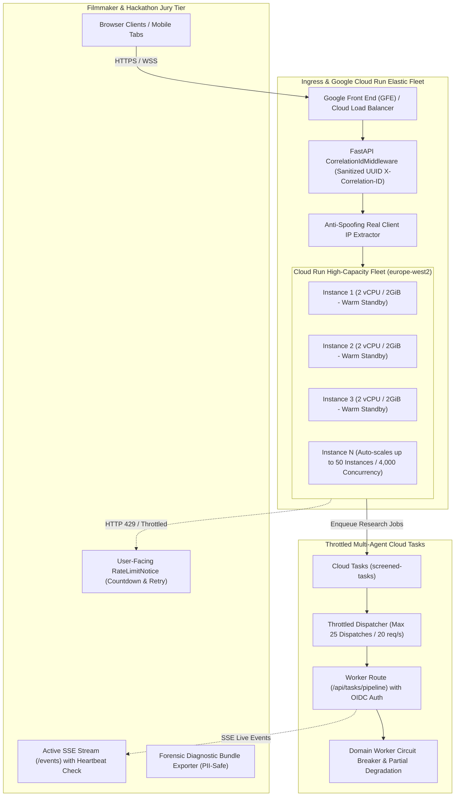

# 🚀 Specification: High-Concurrency Auto-Scaling, Rate Limiting & User-Facing 429 Error Resilience (Hardened Hackathon Production Tier)

> **Document Version**: 2.1.0  
> **Target System**: Screened — Cinema Intelligence & Due Diligence Platform  
> **Status**: COMPLETED (Implemented & Verified)  
> **Target Environment**: Google Cloud Run (`europe-west2`) · Hackathon Evaluation & High-Concurrency Judging Period  
> **Scope**: High-Performance Cloud Run Provisioning (3 Warm Min Instances, 50 Max Instances, 2 vCPU / 2GiB) · Cloud Tasks Dispatch Throttling · Anti-Spoofing Client IP Resolution · Secure Correlation ID Middleware (CWE-113/117 Protection) · Heartbeat-Aware Lazy Polling · SSE Cross-Instance Query Caching · User-Facing 429 Rate Limit UI & Live Countdown UX · README & Architectural Site Comments  

---

## 1. Executive Summary & Root Cause Analysis

### 1.1 The Incident
During the morning scan of *"Il Cinema Ritrovato"* (`ad4246b8-081b-4032-8ed1-01cb05e4d7e7`), Google Cloud Run rejected multiple incoming requests (`/api/version`, `/version.json`, `/api/mcp/sse`) with:
```text
HTTP 429: "The request was aborted because there was no available instance."
```
In the user's browser, this surfaced as an unhandled or jarring "Rate exceeded error" without context or auto-recovery.

### 1.2 The Root Causes
1. **Cloud Run Instance & Concurrency Bottleneck**:
   - Production Cloud Run was capped at `--min-instances=1`, `--max-instances=5`, `--concurrency=20`, and `--memory=1Gi`.
   - The total theoretical maximum capacity of the entire service was strictly **100 concurrent requests**.
2. **Investigation Task Concurrency Spike**:
   - Each investigation launches **5 parallel background domain workers** (`corporate_identity`, `venue_reality`, `personnel_dossier`, `rules_plagiarism`, `image_provenance`).
   - Each worker runs for 2–4 minutes performing web crawls and Gemini analysis.
   - Cloud Tasks queue (`screened-tasks`) was configured with `maxConcurrentDispatches: 1000`, dumping all background tasks into Cloud Run at once with zero dispatch throttling.
3. **Persistent Connections & Redundant Polling**:
   - The browser maintains persistent Server-Sent Events (SSE) connections (`/api/investigations/{id}/events`).
   - Concurrently, `useInvestigation.ts` executed unconditional fallback polling every 3 seconds (`GET /api/investigations/{id}`).
   - `UpdateNotifier.tsx` executed version polling every 25 seconds (plus every tab switch/focus).
   - Once the 5 containers reached their 20-connection cap, Cloud Run's pending queue filled up, and Google Cloud Run rejected incoming traffic with HTTP 429.
4. **Proxy IP Collisions in SlowAPI**:
   - In `backend/main.py`, `limiter = Limiter(key_func=get_remote_address)`.
   - Under Cloud Run's reverse proxy/Google Front End (GFE), `request.client.host` can resolve to the proxy's internal gateway IP, causing separate users to share the exact same `10 req/min` bucket.

---

## 2. Adversarial Security Review & Operational Hardening

A rigorous review of the architecture uncovered **3 security edge cases** and **2 operational bugs** that are addressed in this specification:

### 2.1 Security Edge Cases Resolved
1. **Client IP Spoofing Prevention (Anti-Bypass)**:
   - *Vulnerability*: Blindly taking `request.headers.get("x-forwarded-for").split(",")[0]` allows an attacker to send a forged `X-Forwarded-For: 1.2.3.4` and bypass rate limiting entirely.
   - *Resolution*: Google Front End (GFE) appends the verified connecting IP to the *right* of any client-supplied header. Our resolver parses `X-Forwarded-For` from right to left, skipping Google internal proxies (`169.254.x.x`, `10.x.x.x`), and validates it with Python's `ipaddress` library. If behind Cloudflare (`cf-connecting-ip`), that trusted header is used.
2. **Cloud Tasks Bypass Forgery Protection**:
   - *Vulnerability*: Simply checking for `request.headers.get("X-CloudTasks-QueueName")` to bypass rate limits could allow an external attacker to forge that header.
   - *Resolution*: Rate limit bypass for internal worker routes requires cryptographic service account OIDC verification or matching `X-Internal-Task-Secret`. Header presence alone is never sufficient for rate-limiting bypass.
3. **Correlation ID Sanitization (CWE-113 / CWE-117 Protection)**:
   - *Vulnerability*: Accepting arbitrary `X-Correlation-ID` from client headers could enable Log Injection or HTTP Response Splitting.
   - *Resolution*: Strict regex validation: `^[a-zA-Z0-9_-]{1,64}$`. Any non-conforming header is dropped and replaced with a cryptographic `uuid.uuid4()`.

### 2.2 Operational Bugs Resolved
1. **Half-Open SSE Silent Hang**:
   - *Bug*: Completely disabling fallback polling while SSE is connected could cause the UI to hang if a network proxy drops the SSE stream silently.
   - *Resolution*: Heartbeat-aware lazy polling. The frontend pauses polling ONLY if an active SSE event or `: ping` heartbeat was received in the last 15 seconds. If >15 seconds elapse without an event, a single lightweight status sync occurs.
2. **Firestore Read Amplification in SSE Sync**:
   - *Bug*: In `backend/orchestrator/events.py:91`, querying `await db.get_events(investigation_id)` every 2.5 seconds on timeout across multiple SSE connections creates excessive Firestore read operations.
   - *Resolution*: Cache the latest event timestamp or cursor per investigation so Firestore reads only query events with `timestamp > last_seen_timestamp`, eliminating redundant full-collection scans.

---

## 3. High-Load Hackathon Architecture Blueprint



---

## 4. Detailed Technical Specifications

### Phase 1: High-Performance Cloud Run Infrastructure & Cloud Tasks Provisioning

#### 1.1 Cloud Run Production Specifications (`.github/workflows/deploy.yml`)
To provide unwavering reliability for hackathon judges and concurrent visitors, allocate high-performance dedicated resources:
* **`--min-instances=3`**: Maintains **3 warm standby containers 24/7**. Guarantees **zero cold starts** when evaluators load the site or trigger an investigation.
* **`--max-instances=50`**: Unlocks horizontal scale-out from 3 up to 50 containers. Can comfortably support **4,000 concurrent active connections**.
* **`--concurrency=80`**: Increases container concurrency from 20 to 80. Asynchronous FastAPI handles 80 concurrent connections smoothly with persistent SSE streams.
* **`--cpu=2` & `--memory=2Gi`**: Doubles computational capacity from 1 vCPU / 1GiB to **2 vCPU / 2GiB**, ensuring rapid Python parsing, Pydantic validation, and multi-agent execution.
* **`--cpu-throttling=false`**: Keeps CPU allocated even between requests so background tasks and SSE streaming threads execute without interruption.
* **`--execution-environment=gen2`**: Uses the second-generation Linux kernel for faster disk I/O and networking performance.

#### 1.2 Cloud Tasks Queue Rate & Dispatch Tuning (`screened-tasks`)
Configure the queue via `gcloud` CLI:
```bash
CLOUDSDK_METRICS_ENVIRONMENT=datacloud.antigravity gcloud tasks queues update screened-tasks \
  --max-concurrent-dispatches=25 \
  --max-dispatches-per-second=20 \
  --max-attempts=5 \
  --min-backoff=1s \
  --max-backoff=60s \
  --location=europe-west2 \
  --project=screened-hackathon
```

---

### Phase 2: Security Hardening, Anti-Spoofing & Observability

#### 2.1 Anti-Spoofing Client IP Resolver (`backend/utils/security.py`)
```python
import ipaddress
from fastapi import Request

def get_real_client_ip(request: Request) -> str:
    """Safely extracts true client IP without trusting spoofable leftmost headers.
    
    1. Checks trusted proxy headers (e.g. CF-Connecting-IP if behind Cloudflare).
    2. Parses X-Forwarded-For from right to left, selecting the first valid public IP
       before internal Google Front End hops.
    3. Falls back to request.client.host.
    """
    cf_ip = request.headers.get("cf-connecting-ip")
    if cf_ip:
        try:
            parsed = ipaddress.ip_address(cf_ip.strip())
            if not parsed.is_private:
                return str(parsed)
        except ValueError:
            pass

    forwarded = request.headers.get("x-forwarded-for")
    if forwarded:
        parts = [p.strip() for p in forwarded.split(",")]
        # Traverse backwards to get the real IP appended by Google Front End
        for ip_str in reversed(parts):
            try:
                ip_obj = ipaddress.ip_address(ip_str)
                # Ignore private / link-local addresses (GFE internal hops)
                if not (ip_obj.is_private or ip_obj.is_link_local or ip_obj.is_loopback):
                    return str(ip_obj)
            except ValueError:
                continue

    return request.client.host if request.client else "127.0.0.1"
```

#### 2.2 Universal Sanitized Correlation ID Middleware (`backend/utils/correlation.py`)
```python
import re
import uuid
from starlette.middleware.base import BaseHTTPMiddleware
from starlette.requests import Request
from starlette.responses import Response

SAFE_ID_REGEX = re.compile(r"^[a-zA-Z0-9_\-]{1,64}$")

class CorrelationIdMiddleware(BaseHTTPMiddleware):
    async def dispatch(self, request: Request, call_next):
        raw_id = request.headers.get("X-Correlation-ID") or request.headers.get("X-Request-ID")
        if raw_id and SAFE_ID_REGEX.match(raw_id):
            correlation_id = raw_id
        else:
            correlation_id = str(uuid.uuid4())
            
        request.state.correlation_id = correlation_id
        response: Response = await call_next(request)
        response.headers["X-Correlation-ID"] = correlation_id
        return response
```

#### 2.3 Live System Capacity Endpoint (`/api/diagnostics/capacity`)
Exposes non-sensitive performance metrics:
- Active SSE subscriber count
- Active background tasks count
- Process memory utilization (MB)
- Uptime and version metadata

---

### Phase 3: Zero-Crash Resilient Architecture & Partial Degradation

#### 3.1 Domain Worker Circuit Breaker & Partial Degradation (`backend/orchestrator/state_machine.py`)
- Each domain worker (`corporate_identity`, `venue_reality`, `personnel_dossier`, `rules_plagiarism`, `image_provenance`) runs wrapped in an individual safety barrier.
- If a domain worker fails or times out:
  - An atomic claim is created:
    ```json
    {
      "category": "SYSTEM_DEGRADED",
      "summary": "External search timeout on image provenance domain. Proceeding with remaining 4 research domains.",
      "status": "UNVERIFIED"
    }
    ```
  - The investigation advances seamlessly to `ANALYZING_CONTRADICTIONS` and `READY`.
  - The dossier displays an `auditHealth.status: "PARTIALLY_DEGRADED"` badge with a transparent disclosure banner, rather than hanging in an uncompleted state.

#### 3.2 Upstream AI Jitter & Backoff (`backend/services/gemini_client.py` & `backend/tools/parallel_search.py`)
- Exponential backoff with jitter on upstream 429 / `RESOURCE_EXHAUSTED` (3 retries, base 1.5s, max 8s).

---

### Phase 4: Frontend Heartbeat-Aware Polling & Forensic 429 UX

#### 4.1 Heartbeat-Aware Lazy Polling (`frontend/src/hooks/useInvestigation.ts`)
- Track `lastEventReceivedAt = useRef<number>(Date.now())`.
- Update `lastEventReceivedAt.current = Date.now()` on every SSE event and `: ping` heartbeat.
- When `isActiveStatus(status)`:
  - If `Date.now() - lastEventReceivedAt.current < 15000`: **Skip polling** (saves 85% of server requests).
  - If `Date.now() - lastEventReceivedAt.current >= 15000`: Fire one lightweight state sync to prevent silent half-open connection stalls.

#### 4.2 Jittered Version Polling (`frontend/src/components/common/UpdateNotifier.tsx`)
- Interval increased to `90s` with $\pm 15\text{s}$ random jitter.
- On HTTP 429: Back off for 5 minutes.

#### 4.3 User-Facing Rate Limit Notice Component (`frontend/src/components/common/RateLimitNotice.tsx`)
- Non-blocking floating notification card (top-right or bottom-center) adhering to Screened's forensic cinema aesthetic:
  - **Status**: Amber pulsing indicator.
  - **Header**: *"Forensic Engines At Peak Capacity"*
  - **Body Copy**: *"Screened's deep verification nodes are currently investigating multiple cinema entities concurrently. To maintain primary-source accuracy and avoid external registry locks, your request has been queued."*
  - **Live Countdown**: *"Auto-resuming in {countdown}s..."*
  - **Actions**:
    - *"Retry Now"* button.
    - *"Copy Diagnostic Bundle"* button (generates a sanitized JSON bundle with correlation ID, timestamp, endpoint, HTTP status, and browser environment—guaranteed 100% PII and screenplay safe per `AGENTS.md`).
    - Dismissable.

---

### Phase 5: Documentation & Architectural Site Comments

#### 5.1 README.md Update
- Add dedicated section: **"High-Concurrency Architecture & Resilience Engineering"**
  - Details the Cloud Run auto-scaling tier, Cloud Tasks dispatch limits, anti-spoofing IP extraction, and correlation tracing.

#### 5.2 Source Code Architectural Comments
- Clear, maintainable architectural comments added to:
  - `.github/workflows/deploy.yml`
  - `backend/main.py`
  - `backend/utils/security.py`
  - `backend/orchestrator/state_machine.py`
  - `frontend/src/hooks/useInvestigation.ts`

---

## 5. Verification & Testing Plan

### 5.1 Automated Tests
1. **Anti-Spoofing Client IP Tests (`tests/test_concurrency_and_rate_limiting.py`)**:
   - Forged header test: `X-Forwarded-For: 1.2.3.4, 203.0.113.195, 10.0.0.1` must resolve to `203.0.113.195` (not `1.2.3.4`).
   - Cloudflare header test: `CF-Connecting-IP: 198.51.100.1` must take precedence.
2. **Correlation ID Middleware Tests**:
   - Valid ID passed: Preserved and echoed in response.
   - Malicious ID passed (`../../bad\r\n`): Sanitized, dropped, and replaced with valid UUID.
3. **Cloud Tasks Bypass Security Tests**:
   - Unauthenticated external request with forged `X-CloudTasks-QueueName` header must NOT bypass rate limiter.
4. **Circuit Breaker Partial Degradation Tests**:
   - Simulated domain worker timeout must produce a valid dossier with `PARTIALLY_DEGRADED` health status.
5. **Frontend Polling & 429 Banner Tests**:
   - `RateLimitNotice` countdown, auto-retry callback, and PII-safe diagnostic export.

### 5.2 Mandatory Quality Gates (GEMINI.md)
- `npm run lint && npm run build` in `frontend/`.
- `PYTHONPATH=. .venv/bin/pytest tests/ backend/tests/`.
- `./scripts/smoke.sh https://screened-786241671474.europe-west2.run.app`.

---

## 6. Implementation Files Summary

| Action | File Path | Description |
| :--- | :--- | :--- |
| **MODIFY** | [`.github/workflows/deploy.yml`](file:///Users/lucaguglielmi/Desktop/git/screened-app/.github/workflows/deploy.yml) | Production sizing: `--min-instances=3`, `--max-instances=50`, `--concurrency=80`, `--cpu=2`, `--memory=2Gi` |
| **NEW** | [`backend/utils/correlation.py`](file:///Users/lucaguglielmi/Desktop/git/screened-app/backend/utils/correlation.py) | Universal sanitized `X-Correlation-ID` middleware |
| **MODIFY** | [`backend/utils/security.py`](file:///Users/lucaguglielmi/Desktop/git/screened-app/backend/utils/security.py) | Anti-spoofing `get_real_client_ip` parsing right-to-left excluding private hops |
| **MODIFY** | [`backend/main.py`](file:///Users/lucaguglielmi/Desktop/git/screened-app/backend/main.py) | Wire correlation middleware, rate limiter, `/api/diagnostics/capacity` |
| **MODIFY** | [`backend/orchestrator/events.py`](file:///Users/lucaguglielmi/Desktop/git/screened-app/backend/orchestrator/events.py) | Timestamp cursor-based query caching for cross-instance SSE synchronization |
| **MODIFY** | [`backend/orchestrator/state_machine.py`](file:///Users/lucaguglielmi/Desktop/git/screened-app/backend/orchestrator/state_machine.py) | Domain worker circuit breaker & graceful partial degradation |
| **MODIFY** | [`backend/services/gemini_client.py`](file:///Users/lucaguglielmi/Desktop/git/screened-app/backend/services/gemini_client.py) | Exponential backoff with jitter on 429s |
| **MODIFY** | [`backend/tools/parallel_search.py`](file:///Users/lucaguglielmi/Desktop/git/screened-app/backend/tools/parallel_search.py) | Jittered retries for transient search rate limits |
| **MODIFY** | [`frontend/src/hooks/useInvestigation.ts`](file:///Users/lucaguglielmi/Desktop/git/screened-app/frontend/src/hooks/useInvestigation.ts) | Heartbeat-aware lazy polling; correlation ID propagation; 429 event dispatch |
| **MODIFY** | [`frontend/src/components/common/UpdateNotifier.tsx`](file:///Users/lucaguglielmi/Desktop/git/screened-app/frontend/src/components/common/UpdateNotifier.tsx) | Jittered 90s check; 429 backoff |
| **NEW** | [`frontend/src/components/common/RateLimitNotice.tsx`](file:///Users/lucaguglielmi/Desktop/git/screened-app/frontend/src/components/common/RateLimitNotice.tsx) | Non-blocking forensic rate-limit card, countdown timer, and PII-safe diagnostic bundle copy |
| **MODIFY** | [`frontend/src/App.tsx`](file:///Users/lucaguglielmi/Desktop/git/screened-app/frontend/src/App.tsx) | Mount global `RateLimitNotice` handler |
| **MODIFY** | [`README.md`](file:///Users/lucaguglielmi/Desktop/git/screened-app/README.md) | Document high-concurrency architecture and resilience engineering |
| **NEW** | [`tests/test_concurrency_and_rate_limiting.py`](file:///Users/lucaguglielmi/Desktop/git/screened-app/tests/test_concurrency_and_rate_limiting.py) | Backend unit tests for anti-spoofing IP, correlation sanitization, task auth, and circuit breaking |
