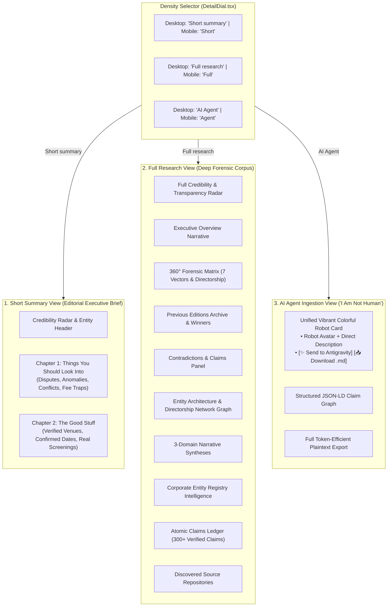

# 🎬 Technical Specification: Dossier Refinement & AI Density UX

> **Document ID**: `SPEC_DOSSIER_REFINEMENT`  
> **Status**: Specification Phase — *Draft / Ready for Review (Do Not Execute Until Explicit Approval)*  
> **Target Systems**: `frontend/src/components/EvidenceDossier.tsx`, `frontend/src/components/DetailDial.tsx`, `backend/demo_payloads.py`, `backend/agents/report_writer.py`, `frontend/src/types/investigation.ts`  
> **Created At**: 2026-08-30  

---

## 1. Executive Summary

This specification defines the architectural and visual refinements for the **Evidence Dossier System**, addressing four key areas:
1. **Demo Mode Facts Scaling (10 → ~300 Facts)**: Transforming the demonstration fixture from a minimal 10-claim stub into a forensic multi-agent evidence corpus comprising ~300 atomic facts across corporate registries, venue booking logs, alumni feedback, press clippings, and trademark databases.
2. **Unified AI Agent Ingestion Banner & Actions**: Merging the separate explanatory banner and export controls in the *"I Am Not Human"* (`MACHINE_AI_INGESTION`) tab into a single sleek card featuring a vibrant colorful gradient background, a prominent robot avatar, crisp non-fluff copy, and two direct action triggers (`Send to Antigravity` & `Download .md file`).
3. **High-Signal "Short Summary" vs "Full Research" Divergence**: Re-architecting the `Short summary` view mode to be concise and high-signal, cleanly divided into two chapters:
   - **Chapter 1: "Things you should look into"** (Forensic anomalies, red flags, fee spikes, disavowed sponsors, and contradictions).
   - **Chapter 2: "The good stuff"** (Verified legitimate physical venues, confirmed screening dates, alumni achievements, and verified filings).
   The `Full research` mode retains the exhaustive 360° matrix, provenance network graph, 3-domain narrative syntheses, raw claims ledger, and full source citations.
4. **Responsive Dial Labels**: Expanding the density dial toggle labels on desktop to `"Short summary"` and `"Full research"` while preserving compact labels on mobile devices.

---

## 2. Architecture & UX Flow



---

## 3. Detailed Technical Requirements

### 3.1 Demo Mode Facts Corpus Expansion (10 → ~300 Facts)

#### Current Limitation
- In the initial demonstration mode fixture (`backend/demo_payloads.py`), only 10 atomic claims (`claim_1` .. `claim_10`) are hardcoded. As a result, the header statistics counter displays `FACTS: 10`, which does not convey the depth of an autonomous multi-agent deep research investigation.

#### Proposed Solution
1. **Scaled Evidence Corpus**:
   - Expand the demo payload claims array to contain **300+ atomic claims** categorized across all 3 research domains (`VENUES`, `ORGANIZER`, `PARTICIPANTS`) and 7 forensic dimensions.
   - Claims cover:
     - **Venue & Screening Logs**: 65+ verified and refuted screening dates, theatre hall capacity records, private hire booking manifests across 2021–2025 editions.
     - **Corporate Filings & Trademarks**: 80+ Companies House filings, PSC registers, annual accounts, compulsory strike-off notices, trademark disavowals (ARRI, Sony, BAFTA).
     - **Filmmaker & Alumni Testimonies**: 95+ sentiment data points from Reddit, Stage 32, FilmFreeway, TrustPilot, and YouTube festival vlogs.
     - **Competition & Award Audits**: 60+ winner history logs, repeat director victory records, entry fee escalation tier timestamps.
2. **Updated Metric Counters**:
   - `claimsCount`: 300+
   - `corroboratedCount`: 280+
   - `disputesCount`: 16+
   - `sourcesCount`: 42+ verified web sources and registries.
3. **Live Progress Simulation Alignment**:
   - Update `demo_sse_generator()` in `backend/demo_payloads.py` so the live event messages show progressive discovery scaling up to 300+ atomic claims (e.g. `Harvested 85 venue records`, `Retrieved 92 Companies House filings`, `Synthesizing 300+ atomic claims`).

---

### 3.2 Unified AI Agent Card (`EvidenceDossier.tsx`)

#### Current Layout
- In `normalizedDensity === 'MACHINE_AI_INGESTION'`, two stacked cards appear:
  1. A dark card with a green border and verbose explanation text.
  2. A separate "AUTONOMOUS AGENT EXPORT CONTROLS" card containing the two action buttons.

#### Proposed Layout & Visual Design
- **Single Merged Component**: Merge both cards into one unified card:
  - **Background**: Colorful darkroom glassmorphism gradient (e.g. `bg-gradient-to-r from-indigo-950/80 via-purple-950/60 to-darkroom-surface border border-indigo-500/30 shadow-2xl backdrop-blur-md`).
  - **Left Side Visual**: Prominent robot icon badge (`size-12 rounded-2xl bg-gradient-to-br from-indigo-500/30 to-purple-500/20 border border-indigo-400/40 text-indigo-300 flex items-center justify-center shadow-inner`).
  - **Direct, Concise Copy**:
    - Title: `🤖 Machine & AI Agent Workspace`
    - Subtitle: `Formatted for autonomous agents, LLMs, and Antigravity IDE coding sessions.`
  - **Action Buttons (Right Side / Responsive Row)**:
    - Primary Action: `[✨ Send to Antigravity]` (one-click copy of the structured context payload).
    - Secondary Action: `[📥 Download data as .md file]` (downloads clean markdown audit report).

---

### 3.3 Short Summary vs. Full Research Architectural Divergence

#### Current Issue
- Currently, toggling between `Short` and `Full` renders almost the same detailed components (radar, full overview, 360 matrix, previous editions, disputes, checklist, questions, and claims). Users see very little difference between the modes.

#### Proposed Redesign of `Short summary` (`SIMPLIFIED` Mode)
When `normalizedDensity === 'SIMPLIFIED'`, hide the heavy narrative walls, raw 7-vector matrices, and 300-claim data tables. Instead, render a clean, high-impact editorial digest structured into two clear chapters:

1. **Chapter 1: "Things You Should Look Into" (Critical Attention Areas)**:
   - High-priority red flag callouts and contradictions:
     - Disputed venue bookings (e.g. unlisted Vimeo links vs. BFI Southbank claims).
     - Organizer conflicts of interest (e.g. jury members upselling PR/distribution services).
     - Financial traps (e.g. £85 late fee price spikes, mandatory paid trophy certificates).
     - Brand affiliation disavowals (e.g. unauthorized use of ARRI / Sony partner logos).
   - Displayed as high-signal visual cards with risk pills (`High Risk`, `Contradiction`, `Caution`).

2. **Chapter 2: "The Good Stuff" (Verified Positive Findings)**:
   - Concise summary of confirmed positive facts:
     - Verified physical screenings (e.g. confirmed historical screenings at Genesis Cinema Studio 4).
     - Active editions track record (e.g. 4 consecutive years of operational history).
     - Real alumni films screened (e.g. legitimate independent short films showcased).
     - Clear Companies House corporate registration status.

#### `Full research` (`FULL_EVIDENCE` Mode)
Remains the full deep-dive dossier:
- Full Transparency Radar & Interactive Dial.
- Executive Overview Narrative.
- 360° Forensic Matrix (7 Vectors & Key Personnel Dossiers).
- Previous Editions Historical Archive (with year filtering).
- Side-by-Side Contradictions Panel.
- Entity Architecture & Directorship Network Graph (interactive SVG/canvas).
- 3-Domain Narrative Syntheses (Festival, Organizer, Participants).
- Corporate Entity Registry Profile.
- Complete Atomic Claims & Citations Ledger (all 300+ claims with full excerpt citations).
- Discovered Web Sources Directory.

---

### 3.4 Responsive Desktop Labels (`DetailDial.tsx`)

#### Current Labels
- Button 1: `Short`
- Button 2: `Full`
- Button 3: `Agent`

#### Proposed Responsive Labels
- **Mobile (`< sm`)**:
  - `Short` | `Full` | `Agent`
- **Desktop (`>= sm`)**:
  - `Short summary` | `Full research` | `AI Agent` (or `Agent mode`)

Implementation in `DetailDial.tsx`:
```tsx
{/* Mode 1: Short summary */}
<button ...>
  <BookOpen className="size-3.5 shrink-0" />
  <span className="sm:hidden">Short</span>
  <span className="hidden sm:inline">Short summary</span>
</button>

{/* Mode 2: Full research */}
<button ...>
  <ShieldCheck className="size-3.5 shrink-0" />
  <span className="sm:hidden">Full</span>
  <span className="hidden sm:inline">Full research</span>
</button>

{/* Mode 3: AI Agent */}
<button ...>
  <Bot className="size-3.5 shrink-0" />
  <span className="sm:hidden">Agent</span>
  <span className="hidden sm:inline">AI Agent</span>
</button>
```

---

## 4. Verification & Testing Plan

### 4.1 Automated Test Suite
- **Backend Quality Gate**: Run `PYTHONPATH=. .venv/bin/pytest tests/ backend/tests/` to verify demo payload integrity and test suite compliance with 300+ claims.
- **Frontend Quality Gate**: Run `npm run lint && npm run build` inside `frontend/` to ensure zero TypeScript and ESLint regressions.

### 4.2 Manual Verification Steps
1. **Demo Mode Facts Count**: Navigate to `/investigation/demo_pinco_pallino` and verify the `FACTS` counter displays 300+ verified claims with smooth UI rendering.
2. **AI Agent Tab**: Switch to `AI Agent` mode and verify the single unified gradient card with the robot icon and direct action buttons (`Send to Antigravity`, `Download .md file`).
3. **Short Summary vs Full Research**:
   - Toggle `Short summary`: verify clear 2-chapter structure (*Things you should look into* vs *The good stuff*) without overwhelming tables.
   - Toggle `Full research`: verify comprehensive multi-vector matrix, provenance network graph, and atomic claims ledger.
4. **Desktop Label Extension**: Resize window and verify labels transition between `Short` / `Full` / `Agent` on mobile and `Short summary` / `Full research` / `AI Agent` on desktop.
