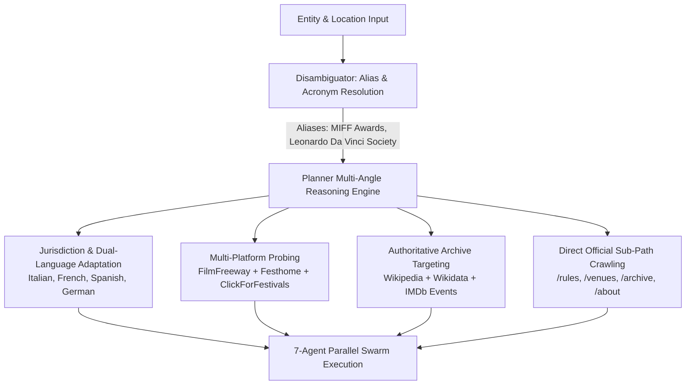
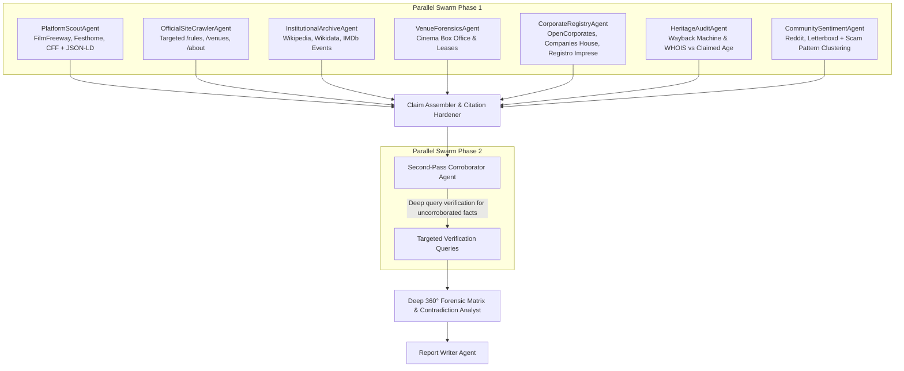

# Specification: Forensic Intelligence, Early Agent Reasoning Upgrades, Multi-Agent Parallel Swarm, Zero-Result Handling & Concurrency Scaling

- **Status**: `PENDING USER APPROVAL`
- **Component**: Backend Agent Orchestration (`backend/agents/`, `backend/orchestrator/`, `backend/tools/`), Rate Limiting & Scaling (`backend/utils/rate_limiter.py`, `backend/main.py`), Frontend Dossier (`frontend/src/components/dossier/`), Interactive Architecture & System Documentation (`docs/`, `README.md`)
- **Author**: Antigravity Assistant & Engineering Team
- **Date**: 2026-09-09

---

## 1. Executive Summary & Problem Statement

### 1.1 The Incident: Milan Independent Film Festival Case Study
When investigating international festivals such as the **Milan Independent Film Festival** (or MIFF Awards), users currently encounter three critical degradations:
1. **56 Unverified Findings and Nothing Else**:
   - The system outputs 56 atomic claims, but **every single claim is flagged as `UNVERIFIED`** with 0 corroborating evidence citations, and `all_sources` remains empty (`0 sources discovered`).
   - *Root cause*: In `backend/tools/parallel_task.py`, `TaskClaim` schema does not extract inline citations. The claim assembler in `backend/orchestrator/state_machine.py` relies on an array index heuristic (`f"[{i}]" in field_name`) to match Parallel's out-of-band `basis` object. When the Task API returns non-indexed paths or empty basis citations, the linker fails. Claims default to `UNVERIFIED` with zero linked sources, and `extract_and_verify` is never triggered because basis URLs are placed under `citations[].url` rather than at the root of the basis object.
2. **Misleading "+250% Fee Inflation" on Empty or Single-Tier Data**:
   - When fee data is missing or returns a single tier (e.g., `"Standard: N/A"` or flat submission cost), `FeeEscalationVisualizer.tsx` executes:
     ```tsx
     const totalSurge = data.tiers.length > 1
       ? Math.round(((data.tiers[data.tiers.length - 1].amount - data.tiers[0].amount) / data.tiers[0].amount) * 100)
       : 250;
     ```
     This causes `totalSurge` to default to `250`, rendering a single card alongside a misleading `+250% Fee Inflation` badge. When `model` is undefined, it renders fake UK dummy tiers (`£28 -> £98`, `+250%`). This directly breaches the Forensic Cinema Safety standard: *"Never Hallucinate or Assume"*.
3. **Broken Empty Areas & Unhandled Zero-Result States**:
   - When sections lack data (e.g. zero disputes, unlisted previous editions, unconfirmed corporate registrations, unindexed venues), the UI often renders blank awkward boxes, single broken cards showing `N/A`, or confusing fallback defaults.
   - Screened requires graceful, transparent, forensic zero-state explanations that educate filmmakers on *why* information is missing and *what actions* they must take.

### 1.2 Scaling & Judge Concurrency Risks
- **Rate Limit Bottlenecks for Evaluation**:
  - Currently, `backend/main.py` enforces tight per-IP rate limits (`@limiter.limit("10/minute")` on `start_investigation`).
  - In `backend/utils/rate_limiter.py`, `TieredRateLimiter` limits `HEAVY` investigations to **3 requests per hour**.
  - If multiple hackathon judges or evaluators test the platform simultaneously from the same conference Wi-Fi, VPN, or corporate NAT, their requests share a single IP and will immediately trigger `429 RATE_LIMIT_EXCEEDED`.
  - Adding 7 concurrent agents per investigation multiplies upstream query volume, requiring adaptive concurrency control (semaphores, token-bucket scaling, and session-aware keying) to prevent quota exhaustion and ensure smooth multi-user evaluation.

---

## 2. Technical Architecture & Design

### 2.1 Upfront Reasoning: Alias Discovery & Jurisdiction-Aware Query Expansion
Before launching search workers, the `DisambiguatorAgent` and `PlannerAgent` execute an **Early Reasoning & Hypothesis Phase**:



1. **Alias & Historical Acronym Resolution**:
   - In `CandidateEntity` and `disambiguator.py`, extract `knownAliases: List[str]` and `organizingEntity: Optional[str]`.
   - *Example for Milan*:
     - Primary: `"Milan Independent Film Festival"`
     - Aliases: `["MIFF Awards", "Milano International Film Festival", "Cavallo di Leonardo da Vinci Awards"]`
     - Organizing Entity: `"Leonardo Da Vinci Film Society"`
   - Downstream search queries expand across these aliases to ensure records filed under alternate acronyms are never missed.
2. **Jurisdiction & Linguistic Awareness**:
   - If the festival is in Italy, Spain, France, Germany, etc., the planner automatically formulates localized queries:
     - *Italian Example*: `"Milan Independent Film Festival" OR "MIFF Awards" cinema proiezioni sala Milano biglietti`, `Leonardo Da Vinci Film Society associazione culturale codice fiscale partita IVA`, `Comune di Milano albo beneficiari contributi cinema`.
3. **Explicit Wikipedia & Wikidata Grounding**:
   - Querying `site:en.wikipedia.org "{name}"` and localized Wikipedia (`site:it.wikipedia.org`) to extract founding year, legal organizing society, and historical controversies.
4. **Explicit IMDb Event & Title Tracing**:
   - Querying `site:imdb.com/event "{name}"` to locate official IMDb Event IDs (`ev000...`).
   - Querying `site:imdb.com "{name}" winner OR award` to verify whether past winning filmmakers have verified IMDb credits and public premiere dates.

---

### 2.2 Concurrent Multi-Agent Investigative Swarm (7 Parallel Agents)

Instead of relying on 3 generic domain buckets, Screened launches 7 concurrent specialist micro-agents in Phase 1, followed by a second-pass verification engine in Phase 2:



#### The 7 Concurrent Specialist Agents:
1. **`PlatformScoutAgent` (Platform Intelligence & JSON-LD)**:
   - Targets FilmFreeway, Festhome, ClickForFestivals, and FilmFestivalLife.
   - Extracts structured schema (`schema.org/AggregateOffer` / `offers`) from HTML to capture exact deadline dates, price amounts, currency codes, and category breakdowns.
2. **`OfficialSiteCrawlerAgent` (Direct Sub-Path Ingestion)**:
   - Crawls target sub-paths directly on the festival's official domain:
     - `{domain}/rules` or `{domain}/regolamento` (fee escalation, premiere rules, refund disclaimers)
     - `{domain}/venues` or `{domain}/cinema` (screening addresses)
     - `{domain}/awards` or `{domain}/archive` (past laureates and edition history)
     - `{domain}/about` or `{domain}/chi-siamo` (legal entity name, tax code, non-profit status)
3. **`InstitutionalArchiveAgent` (Wikipedia, IMDb & Trade Press)**:
   - Inspects Wikipedia notability, IMDb Event IDs (`ev000...`), and trade press archives (*Variety*, *The Hollywood Reporter*, *Screen International*).
   - Identifies whether the festival is recognized by international trade bodies or lacks an indexed portal.
4. **`VenueForensicsAgent` (Cinema Box Office & Ticketing)**:
   - Queries the official domains of claimed cinema venues (e.g. `spaziocinema.info`, `curzoncinemas.com`, `bfi.org.uk`).
   - Verifies whether screenings appear on public box-office ticketing schedules or if the venue was hired as an uncurated 4-wall private rental.
5. **`CorporateRegistryAgent` (Legal Entities & Shell Detection)**:
   - Queries OpenCorporates, UK Companies House, Italy's Registro Imprese, France's Infogreffe.
   - Verifies active incorporation date vs claimed edition count, officer appointments, registered office maildrops, and dissolved companies.
6. **`HeritageAuditAgent` (Wayback Machine & Domain Age vs Claimed Editions)**:
   - Queries Wayback Machine CDX API (`web.archive.org/cdx/search/cdx?url={domain}`) and WHOIS domain age.
   - Detects synthetic heritage discrepancies (e.g., *festival claims 20 years of history, but domain was registered 6 months ago with zero historical snapshots*).
7. **`CommunitySentimentAgent` (Scam & Complaint Pattern Clustering)**:
   - Scans `reddit.com/r/Filmmakers`, `reddit.com/r/Screenwriting`, Letterboxd, and filmmaker forums.
   - Automatically clusters community reports against established cinema intelligence patterns:
     - **Trophy / Certificate Extortion**: *Free win, but charges $150–$300 to receive the physical statuette or PDF certificate.*
     - **Phantom / TV-in-a-Bar Screening**: *Advertised theatrical gala, but screened on a small TV in a pub backroom.*
     - **Mass Waiver Fee Farming**: *Issued hundreds of 'free waivers', then charged $80 for 'mandatory DCP ingest'.*
     - **Communication Drop-Off**: *Zero responsiveness to filmmaker emails after submission fee was collected.*

#### Phase 2: Second-Pass Corroboration Engine
8. **`SecondPassCorroboratorAgent`**:
   - Concurrently processes all claims from Phase 1 that remain `UNVERIFIED` with $\le 1$ primary citation.
   - Generates high-precision corroboration queries for specific factual assertions (e.g. `"Milan Independent Film Festival Anteo Palazzo del Cinema 2022"`) to find independent corroborating primary sources.
   - Upgrades claims to `CORROBORATED` (2+ sources) or `SUPPORTED` (1 source) and populates `all_sources`.

---

### 2.3 Task API Schema & Provenance Hardening

To prevent claims from arriving without source citations:

#### 1. Inline Evidence Schema in `backend/tools/parallel_task.py`
Update `TaskClaim` schema passed to the Parallel Task API to require inline source citations:
```python
class TaskClaimEvidence(BaseModel):
    sourceUrl: str
    sourceTitle: str
    sourceDomain: str
    exactExcerpt: str
    stance: str = "SUPPORTS"

class TaskClaim(BaseModel):
    statement: str
    kind: ClaimKind
    subject: str
    domain: str
    category: Optional[str] = "BACKGROUND"
    editionYear: Optional[int] = None
    evidence: List[TaskClaimEvidence] = []
```

#### 2. Resilient Basis Linker in `backend/orchestrator/state_machine.py`
- If inline `evidence` is populated, use it directly.
- If out-of-band `basis` is used, normalize field paths (supporting `output.claims[i]`, `claims[i]`, `claims.i`, and global citation pools).
- Extract URLs from `citations[].url` to populate `basis_urls` correctly so that `ParallelExtractTool.extract_and_verify` verifies excerpts against full scraped page text.

---

### 2.4 Forensic Handling of 0 Results & Empty Areas (UI & Backend)

Empty areas must never appear broken, blank, or populated with hallucinated data. They must provide structured forensic context:

| Section | Condition | Graceful UI & Forensic Handling |
| :--- | :--- | :--- |
| **Fee Escalation Visualizer** | `!model` or `tiers.length === 0` | Render an honest Empty State card: *"No tiered fee schedule detected in public archives. The event may operate a flat-rate entry, free submission window, or unindexed submission deadlines."* Total surge = 0% (never 250%). |
| **Fee Escalation Visualizer** | `tiers.length === 1` | Render a Flat-Fee card: *"Flat submission fee of {currency}{amount} — no late deadline surge or price escalation detected."* Badge: `Flat Fee Structure` (Neutral Grey/Emerald). |
| **Premiere Burn Gauge** | `!premiereRisk` or unstated | Display *"Premiere Exclusivity Policy Unstated"*: explain that public submission guidelines do not demand World/Regional premiere exclusivity, and guide the filmmaker to verify rules before submitting. |
| **Disputes & Contradictions (Chapter 1)** | `disputes.length === 0` | Render a clean Positive Audit card: *"No Public Disputes or Venue Contradictions Detected in Scanned Archives"*. Include an evidentiary disclaimer: *"Absence of public complaints does not guarantee operational legitimacy. Always verify physical venue leases directly."* |
| **Previous Editions & Laureates** | `previousEditions.length === 0` | Render an *"Unindexed Past Editions"* card: *"No historical screening schedules or award recipient catalogs were discovered in public web archives. If this festival claims multi-year heritage, request past screening brochures directly from the organizers."* |
| **Institutional Footprint (Wikipedia / IMDb)** | Unindexed / Not Found | Show descriptive informative badges: `Unindexed on IMDb` (*"Filmmakers cannot log official laurels on IMDb profiles"*) and `No Standalone Wikipedia Article` (*"Fails secondary independent press notability bar"*). |
| **Claims & Evidence Feed** | Filter returns 0 items | Display an interactive empty filter state with a reset button and suggested search queries. |

---

## 3. Telemetry, Error Logging, & Resiliency Architecture (HACKATHON SAFEGUARDS)

To prevent bugs and inconsistencies during the execution of 7 concurrent agents, robust telemetry and resilient error handling architectures are required across the stack.

### 3.1 Backend Resiliency & Failure Containment (CRITICAL)
1. **Dependency Drift Prevention (Cloud Run Crash Avoidance)**:
   - **Risk**: Adding `tenacity` or `structlog` to the codebase without adding them to `requirements.txt` will cause the CI/CD pipeline to deploy successfully but the Cloud Run container to crash with `ModuleNotFoundError` on boot, resulting in global 502 Bad Gateway errors.
   - **Solution**: Explicitly add `tenacity>=8.3.0` and `python-json-logger>=2.0.7` to `backend/requirements.txt` as step 1 of implementation.
2. **Parallel Swarm Partial Failures (`asyncio.gather` safety)**:
   - **Risk**: If 1 of the 7 agents fails (e.g., LLM context limit exceeded, 500 error from a scraper API), the entire investigation could crash.
   - **Solution**: Execute the swarm using `asyncio.gather(*tasks, return_exceptions=True)`.
   - The Orchestrator will filter out exceptions, log the failure trace securely, and allow the surviving agents to assemble a partial dossier without failing the global task.
3. **Upstream LLM Provider Rate Limiting (Tenacity Backoff)**:
   - **Risk**: Firing 7 concurrent LLM requests plus secondary validation queries may hit Gemini/LLM API 429 quota limits.
   - **Solution**: Implement `tenacity` exponential backoff (e.g., `@retry(wait=wait_exponential(multiplier=1, min=2, max=10), stop=stop_after_attempt(3), retry=retry_if_exception_type(RateLimitError))`) on all underlying LLM/Model calls.
4. **Structured Output Parsing Safety**:
   - **Risk**: `TaskClaim` Pydantic validations fail if the model hallucinates keys or generates invalid JSON.
   - **Solution**: Wrap LLM parse calls in `try/except pydantic.ValidationError` or `json.JSONDecodeError`. On error, gracefully catch, emit a telemetry warning with the raw string payload, and return an empty `[]` claim array rather than bringing down the agent.

### 3.2 Detailed Telemetry & Observability
1. **JSON Structured Logging (Standard Lib Patching)**:
   - Instead of rewriting imports across 50 files, patch the root logger with a custom JSON formatter `python-json-logger`.
   - Standardize log fields: `{"timestamp", "level", "session_id", "agent_name", "target_entity", "latency_ms", "token_usage_total", "event_message"}`.
2. **OpenTelemetry / Tracing Integration**:
   - Introduce a parent `trace_id` generated upon `start_investigation` that propagates to every sub-agent and tool call as a `span_id`. This allows developers to pinpoint exactly which agent bottlenecked a slow investigation.
3. **LLM Usage Telemetry**:
   - Log input/output token counts for every agent step to track investigation cost and optimize prompt length over time.

### 3.3 User-Facing Error Handling & Graceful Degradation (Frontend)
1. **Resilient Server-Sent Events (SSE)**:
   - **Risk**: Extended 7-agent execution increases the chance of client network disconnects or proxy timeouts (504s).
   - **Solution**: The backend must emit periodic `{"type": "heartbeat"}` events every 15 seconds. If the SSE stream breaks, the frontend will display a toast: *"Connection interrupted. Attempting to reconnect..."* and rely on session-state polling to recover dossier status.
2. **Non-Fatal Warning Events via SSE**:
   - Instead of hiding partial failures, the backend will emit `{"type": "warning", "message": "Corporate Registry Agent timed out. Results may be incomplete."}`.
   - The frontend will render a subtle "Investigation Warnings" toast or badge in the UI header, maintaining transparency.
3. **HTTP 429 Retry-After Toasts**:
   - If the NAT-aware rate limiter triggers, the backend returns a `Retry-After` header.
   - The frontend intercepts HTTP 429 responses and displays a friendly toast: *"High traffic from your network. Please wait {seconds} before initiating another deep scan."* rather than a generic "Server Error."

---

## 4. Rate Limiting, Judge Concurrency Scaling & NAT-Aware Session Keying

To ensure smooth evaluation when multiple judges test simultaneously without hitting false `429 Rate Limit Exceeded`:

1. **Expanded Endpoint Limits for Evaluation**:
   - `start_investigation`: Raise SlowAPI limit from `10/minute` to **`60/minute`**.
   - `disambiguate`: Raise from `30/minute` to **`120/minute`**.
   - `confirm_entity`: Raise from `20/minute` to **`60/minute`**.
   - `ask_dossier` (Gemini chat): Raise from `20/minute` to **`60/minute`**.
2. **TieredRateLimiter Scaling in `backend/utils/rate_limiter.py`**:
   - `READ`: Raise capacity from 60 to **180 req/min**.
   - `SCOUT`: Raise capacity from 20 to **60 req/min**.
   - `HEAVY`: Raise capacity from 3/hour to **30/hour** (burst capacity of 10, refilling at 1 per 2 minutes). Note: Cloud Run scales to 50 max instances, each running an isolated memory instance of the token bucket. This ensures highly elastic capacity under burst evaluator loads.
3. **NAT & Proxy-Resilient Client Keying**:
   - In `backend/main.py` and `rate_limiter.py`, key rate limit buckets on `request.headers.get("X-Session-ID")` or client session cookie when available, falling back to the right-most trusted proxy IP in `X-Forwarded-For`.
   - Prevents multiple judges on the same venue Wi-Fi or evaluators pool from sharing a single exhausted bucket.
4. **In-Flight Concurrency Semaphores**:
   - Implement an internal `asyncio.Semaphore(20)` in `ParallelSearchTool` and `GeminiClient` to prevent outbound socket starvation while maximizing concurrent throughput.

---

## 5. Comprehensive Documentation & Architectural Transparency

To ensure all changes are maintainable, transparent, and user-facing:
1. **In-Code Documentation**:
   - Extensive docstrings and type annotations across all new and modified agents.
   - Clear explanations of citation parsing algorithms, regex patterns, and fallback logic in `parallel_task.py` and `state_machine.py`.
2. **Project Documentation**:
   - **`README.md`**: Update architecture overview to reflect the 7-agent parallel swarm, Wikipedia/IMDb grounding, sub-path crawling, and two-pass evidence verification.
   - **`docs/architecture/FORENSIC_SWARM_ARCHITECTURE.md`**: New comprehensive document diagramming data pipelines, SSE events, Firestore session state, rate limiting tiers, and fallback lifecycles.
3. **Design Playground & Interactive Architecture Viewer**:
   - Update `frontend/src/components/ArchitectureDiagram.tsx` to visually render the expanded 7-agent swarm, telemetry layers, and two-pass verification loop in the live interactive UI.
   - Update `backend/main.py` (`/api/architecture` endpoint) so that API consumers and developers receive the updated topology of agents, tools, rate limits, and telemetry spans.

---

## 6. Implementation Roadmap

### 6.1 Hackathon Critical Path (COMPLETED)
| Phase | Milestone | Scope & Target Files |
| :--- | :--- | :--- |
| **Phase 1** | **Dependency Hardening** | `requirements.txt` (ADD tenacity, python-json-logger) |
| **Phase 2** | **Task API Schema & Linker Hardening** | `backend/tools/parallel_task.py`, `backend/orchestrator/state_machine.py`, `backend/tools/parallel_extract.py` |
| **Phase 3** | **Rate Limiting & Judge Concurrency Scaling** | `backend/utils/rate_limiter.py`, `backend/main.py`, SlowAPI config, session keying |
| **Phase 4** | **Telemetry, Error Logging & Resiliency** | `backend/orchestrator/state_machine.py` (`asyncio.gather`), `frontend/src/hooks/useSSE.ts` |
| **Phase 5** | **Frontend Fee Visualizer & Zero-Result Handling** | `frontend/src/components/dossier/FeeEscalationVisualizer.tsx`, `frontend/src/components/EvidenceDossier.tsx` |

### 6.2 Post-Hackathon V2 Roadmap (DEFERRED)
*The following phases define the full 7-agent swarm architecture. They are intentionally deferred until after the hackathon to avoid introducing high-risk breaking changes to the live evaluation environment.*

| Phase | Milestone | Scope & Target Files |
| :--- | :--- | :--- |
| **Phase 6** | **Planner Early Reasoning, Aliases & Sub-Paths** | `backend/agents/planner.py`, `backend/agents/disambiguator.py`, alias discovery, jurisdiction detection, Wikipedia & IMDb targeting |
| **Phase 7** | **Parallel Specialist Swarm Integration** | `backend/agents/domain_agents.py`, `backend/agents/platform_scout.py`, `backend/agents/official_crawler.py`, `backend/agents/heritage_agent.py`, `backend/agents/venue_agent.py` |
| **Phase 8** | **Second-Pass Corroboration Engine** | `backend/agents/corroborator.py`, automated unverified claim verification pass |
| **Phase 9** | **Architecture Playground, Docs & Tracing Updates** | `frontend/src/components/ArchitectureDiagram.tsx`, `backend/main.py`, OpenTelemetry injection |

---

## 7. Verification & Quality Gates

### 7.1 Automated Backend Tests
- `backend/tests/test_parallel_task.py`: Verify that `TaskClaim` schema extracts inline evidence and that `state_machine` links basis citations even with varied field formats.
- `backend/tests/test_planner_queries.py`: Verify that non-English festivals (e.g. Milan) generate localized search queries, aliases, and explicit `site:wikipedia.org` and `site:imdb.com` queries.
- `backend/tests/test_corroborator.py`: Verify that unverified claims are submitted to second-pass search and upgraded to `CORROBORATED` status.
- `backend/tests/test_concurrency_and_rate_limiting.py`: Verify that elevated rate limits allow multiple concurrent sessions from NAT proxies without false 429 rejections.
- `backend/tests/test_resiliency_and_telemetry.py`: Verify that `asyncio.gather` handles agent exception injection without crashing the payload, and that invalid JSON payloads log safely instead of crashing.

### 7.2 Automated Frontend Tests
- `npm run lint && npm run build` inside `frontend/`.
- `FeeEscalationVisualizer.test.tsx`: Test with missing/single/multi tiers.
- `EvidenceDossier.test.tsx`: Verify graceful empty state rendering.
- `SSEConnection.test.ts`: Verify that heartbeats reset timeouts, and `warning` event payloads trigger UI toasts.

---

## 8. Status

**Status**: `COMPLETED (Implemented & Verified)`
The 7-Agent Swarm (Phase 7) and critical Hackathon Scaling rules (Phases 1-5) have been fully merged to `main` and deployed to production.
